# Tarea 1.3

# **Ejercicio**: crea una variable con el logaritmo base 10 de 50 y súmalo a otra variable cuyo valor sea igual a 5.

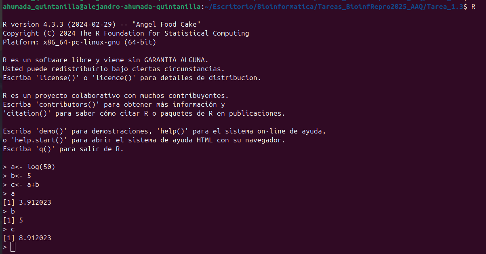

# Ejercicio: suma el número 2 a todos los números entre 1 y 150.

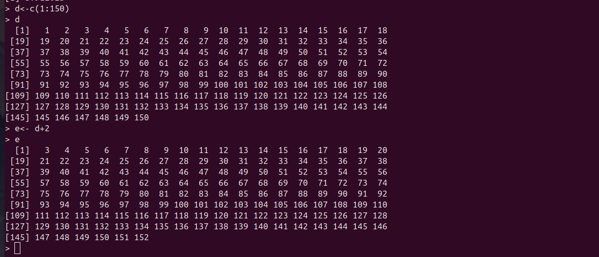

# Ejercicio ¿cuántos números son mayores a 20 en el vector -13432:234?

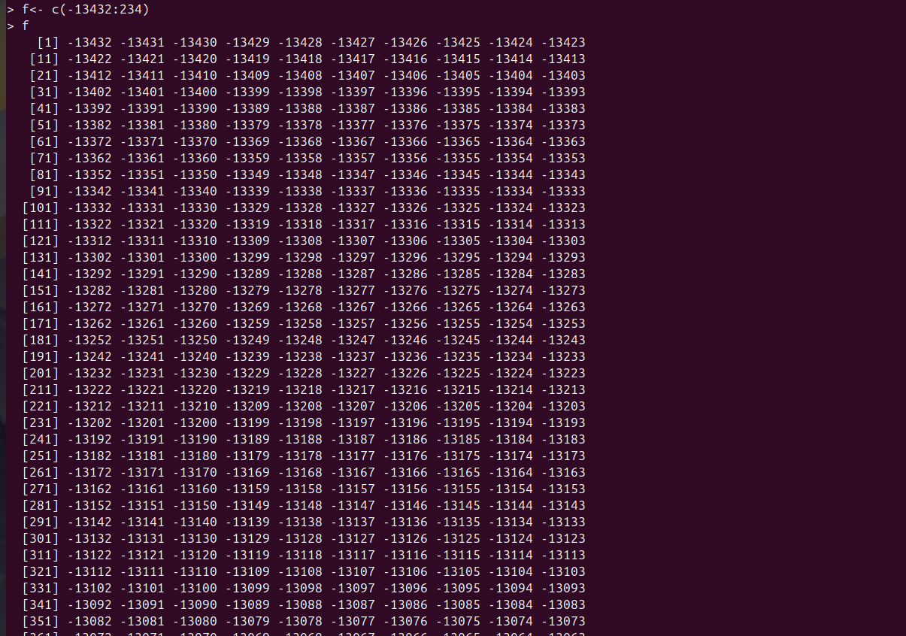
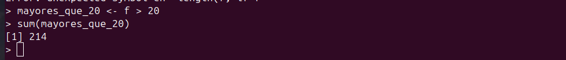

# Ejercicio: Carga en R el archivo PracUni1Ses3/maices/meta/maizteocintle_SNP50k_meta_extended.txt y ponlo en un objeto de R llamado meta_maiz.

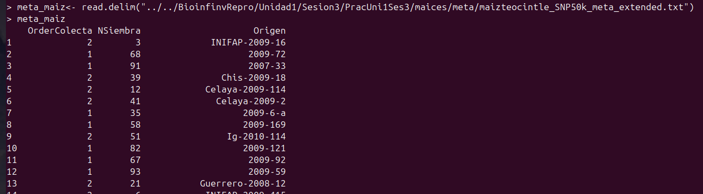

# Ejercicio. Escribe un for loop para que divida 35 entre 1:10 e imprima el resultado en la consola. Modifica el loop anterior para que haga las divisiones solo para los números nones (con un comando, NO con c(1,3,...)). Pista: next. Modifica el loop anterior para que los resultados de correr todo el loop se guarden en una df de dos columnas, la primera debe tener el texto "resultado para x" (donde x es cada uno de los elementos del loop) y la segunda el resultado correspondiente a cada elemento del loop. Pista: el primer paso es crear un vector fuera del loop.

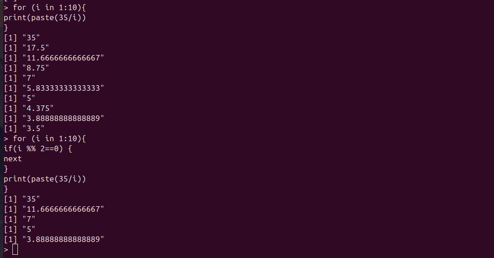
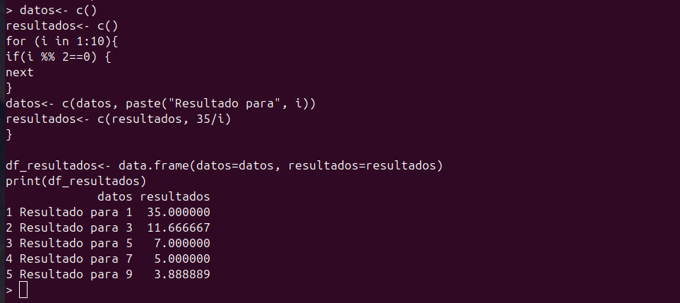
Codigos usados en el ejercicio
El primero es para crear el loop que divide a 35 entre los numeros dle 1 al 10

```
for (i in 1:10){
print(paste(35/i))
}
```

El segundo es para que solo imprima el resultado de los numeros impares

```
for (i in 1:10){
if(i %% 2==0) {
next
}
print(paste(35/i))
}
```

```
datos<- c()
resultados<- c()
for (i in 1:10){
if(i %% 2==0) {
next
}
datos<- c(datos, paste("Resultado para", i))
resultados<- c(resultados, 35/i)
}

df_resultados<- data.frame(datos=datos, resultados=resultados)
print(df_resultados)
```

# Ejercicio: Abre en RStudio el script PracUni1Ses3/mantel/bin/1.IBR_testing.r. Este script realiza un análisis de aislamiento por resistencia con Fst calculadas con ddRAD en Berberis alpina.

## ¿qué hacen los dos for loops del script?

El primer loop 

```
  for(i in c("present", "ccsm", "miroc", "flat", "1800", "2000", "2300", "2500", "2700", "3000", "3300", "3500", "4000")) {

    ## define resistances.out files
    resfile <- paste0(circfolder, "/Balpina_", i, "_resistances.out")

    ### Get effective distances

    eff.dist<-read.effdist(file=resfile, popNames=popNamesFP, des.order=popNames)

    ### Estimate mean effective distance by population
    mean.effD <- apply(eff.dist, 2, mean)  

    ### Name output data
    assign(paste0("B.", i), eff.dist)  # effective distance mat
    assign(paste0("B.mean.", i), mean.effD) # mean effective distances

  }  
```

en primera instancia define los componentes del vector, luego crea el objeto resfile copiando los datos `circfolder, "/Balpina_", i, "_resistances.out"`y define resistances.out files, luego crea la variable eff.dist que lee el archivo resfile y consigue las distancias efectivas. luego se estima la media de la distancia efectiva en la poblacion. Por ultimo se asigna el nombre de los outputs

En el segundo loop

```
  for(i in c("present", "ccsm", "miroc", "flat", "1800", "2000", "2300", "2500", "2700", "3000", "3300", "3500", "4000")) {

    print(paste("Results for", i))

    # Mantel test 
    print("Mantel test")
    x<-mantel.rtest(as.dist(get(paste0("B.",i))), as.dist(B.FstLin), nrepet=10000)
    print(x)

    # Plot
    DistPlot(get(paste0("B.",i)), B.FstLin, plotnames=FALSE,
            ylabel=expression("F"[ST]*"/(1 ??? "[FST]*")"), xlabel=paste("Effective distance", i))

    # get info for df  
    MTpvalue<-round(x$pvalue, 6)
    MTr<-round(x$obs, 4)

    # put results in dataframe
    rster<-paste(i)
    IBRresults<-rbind(IBRresults, c(rster, MTpvalue, MTr))
  } 
```

Nuevamente se definen los componentes del vector, luego se imprime en la consola el resultado para cada valor de i, mas bien se asigna que diga: "Results for i"
luego se imprime Mantel test y se crea la variable "x", posteriormente se construye un grafico de dispersion de las variables y por ultimo se exportan los datos a un dataframe

## ¿qué paquetes necesitas para correr el script?

Se necesita de los siguientes paquetes:

```
library(ade4)
library(ggplot2)
library(sp)
```

## ¿qué archivos necesitas para correr el script?

Se necesita:
DistPlot.R
read.effdisc.R
read.fst_summary_fix.R

# Ejercicio: Escribe una función llamada calc.tetha que te permita calcular tetha dados Ne y u como argumentos. Recuerda que tetha =4Neu.

La funcion creada se detalla a continuacion:

```
calc.tetha <- function(Ne, u) {
  theta <- 4 * Ne * u
  return(theta)
}
```

# Ejercicio: Al script del ejercicio de las pruebas de Mantel, agrega el código necesario para realizar un Partial Mantel test entre la matriz Fst, y las matrices del presente y el LGM, parcializando la matriz flat. Necesitarás el paquete vegan.

no logre entender lo que se habia que hacer con este ejercicio, pedi ayuda a la IA pero aun asi lo logre comprender la logica del ejercicio

# Ejercicio: Escribe un script que debe estar guardado en PracUni1Ses3/maices/bin y llamarse ExplorandoMaiz.R, que 1) cargue en R el archivo PPracUni1Ses3maices/meta/maizteocintle_SNP50k_meta_extended.txt y 2) responda lo siguiente

solo puede cargar el archivo con una ruta absoluta

```
#para que el script funcione se debe modificar la ruta de acceso al archivo
ruta.data<- "Escritorio/Bioinformatica/Tareas_BioinfRepro2025_AAQ/Tarea_1.3/PracUni1Ses3/maices/meta/maizteocintle_SNP50k_meta_extended.txt"
meta_maiz <- read.table(ruta.data, header = TRUE, sep = "\t", stringsAsFactors = FALSE)
print(meta_maiz)
```

## ¿Qué tipo de objeto creamos al cargar la base?

#cuando se carga el archivo se crea un dataframe

## ¿Cómo se ven las primeras 6 líneas del archivo?

```
#primeras 6 filas
head(meta_maiz, 6)
```

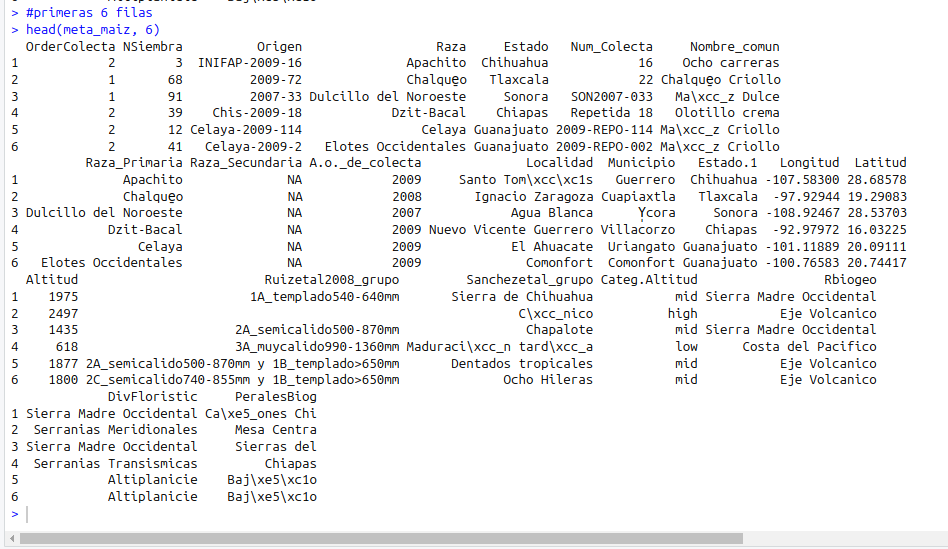

## ¿Cuántas muestras hay?

hay 165 muestras

```#cantidad
nrow(meta_maiz)
```

## ¿De cuántos estados se tienen muestras?

de 19 estados distintos

```
length(unique(meta_maiz$Estado))
```

## ¿Cuántas muestras fueron colectadas antes de 1980?

en total son 8

```
#muestras recolectadas antes de 1980
sum(meta_maiz[["A.o._de_colecta"]] < 1980,  na.rm = TRUE)
n_antes_1980 <- sum(meta_maiz$A.o._de_colecta < 1980)
```

## ¿Cuántas muestras hay de cada raza?

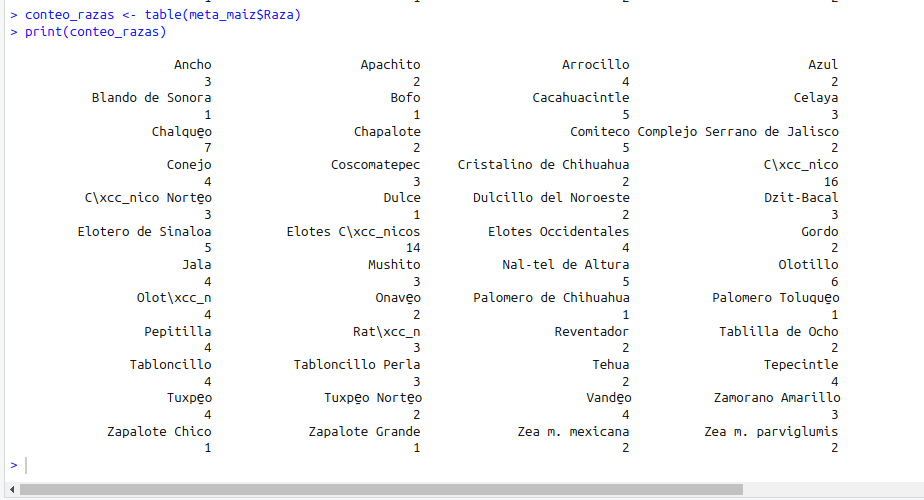

```
#conteo de razas
table(meta_maiz$Raza)
conteo_razas <- table(meta_maiz$Raza)
print(conteo_razas)
```

## En promedio ¿a qué altitud fueron colectadas las muestras?

Fue a 1519.242
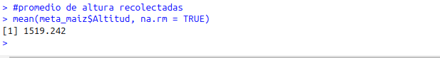

## ¿Y a qué altitud máxima y mínima fueron colectadas?

Fue a 2769 m y 5 m

```
#maxima y minima actitud
max_altitud <- max(meta_maiz$Altitud, na.rm = TRUE)
cat("Altitud máxima:", max_altitud)
min_altitud <- min(meta_maiz$Altitud, na.rm = TRUE)
cat("Altitud mínima:", min_altitud)
```

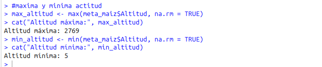

## Crea una nueva df de datos sólo con las muestras de la raza Olotillo

```
#dataframe solo con los datos de Olotillo
olotillo.df <- subset(meta_maiz, Raza == "Olotillo")
```

## Crea una nueva df de datos sólo con las muestras de la raza Reventador, Jala y Ancho

```
#dataframe para la raza Reventador, Jala y Ancho
razas <- c("Reventador", "Jala", "Ancho")
muestras_filtradas <- subset(meta_maiz, Raza %in% razas)
```

## Escribe la matriz anterior a un archivo llamado "submat.cvs" en /meta.

```
#Creacion de archivo csv, ojo que se debe cambiar la ruta absoluta a conveniencia
write.csv(muestras_filtradas, file = "Escritorio/Bioinformatica/Tareas_BioinfRepro2025_AAQ/Tarea_1.3/PracUni1Ses3/maices/meta/muestras_seleccionadas.csv", row.names = FALSE)
```
