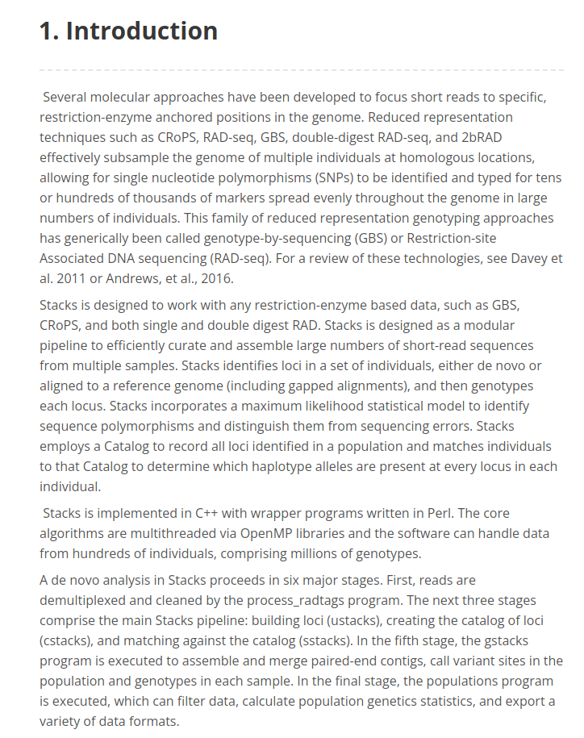
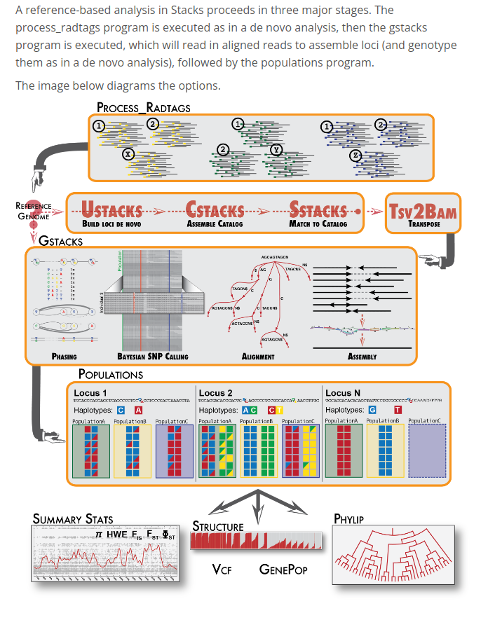
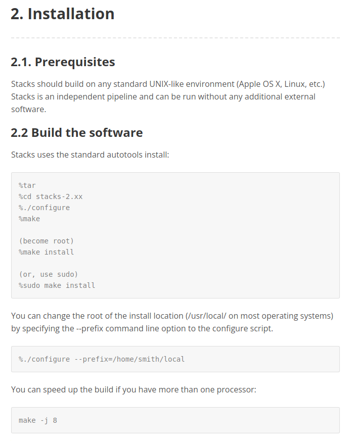
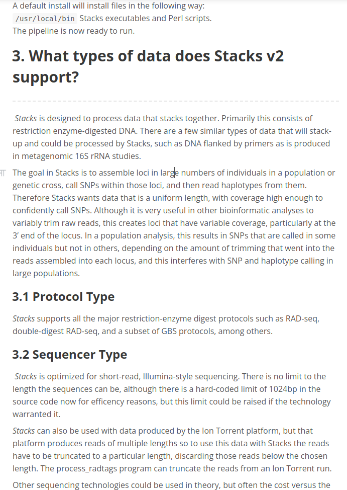
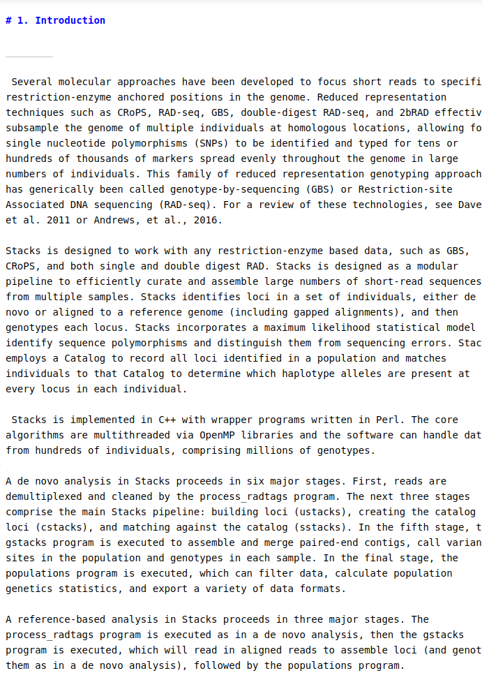
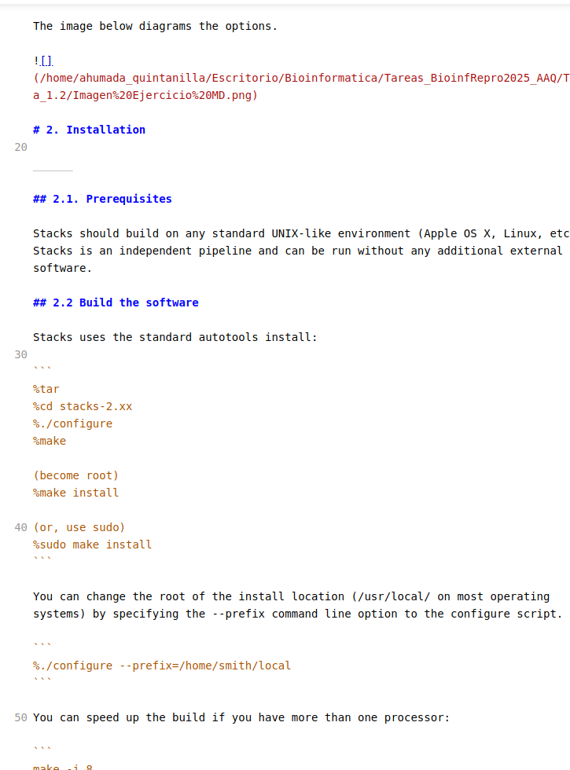
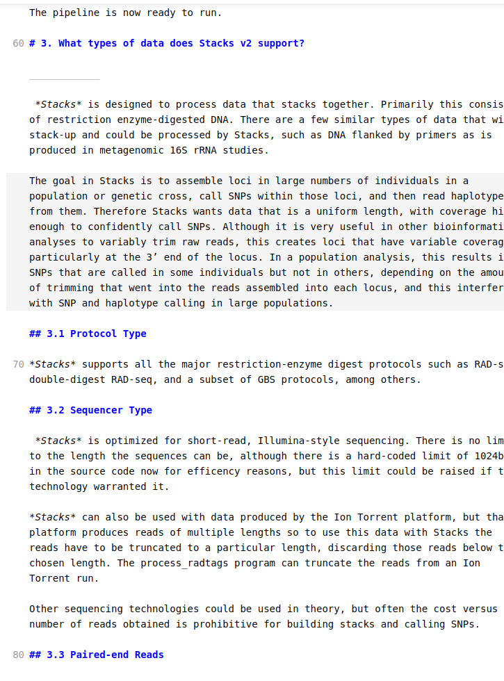

# Tarea sesion 2 unidad 1

## **Ejercicio:** abre el el editor de Markdown de tu preferencia y escribe un texto en formato Markdown de manera que quede

Este ejercicio se realizo en el archivo llamado Ejercicio de MD

Se adjuntan en este escrito algunas imagenes del ejercicio

Codigo del texto:

## **Ejercicio:** clona el repositorio de la clase y actualízalo que vez que sea necesario.

para clonar el repositorio de la clase se uso el comando:

`git clone git@github.com:u-genoma/BioinfinvRepro.git --branch master --single-branch`

A continuacion se muestran las imagenes de los resultados

Figura 1: Codigo utilizado para hacer commit de los cambios realizados

Figura 2: Cambios realizados en el repositorio de la sesion 2

## **Ejercicio:** Mira el siguiente script ([tomado del manual de Stacks](http://catchenlab.life.illinois.edu/stacks/manual/#phand)) y contesta lo siguiente:

1. ¿Cuántos pasos tiene este script?

el script del ejemplo tiene 6 pasos

2. ¿Si quisieras correr este script y que funcionara en tu propio equipo, qué línea deberías cambiar y a qué?

Deberia de cambiar la primera parte del script, donde se definen las rutas y los archivos que utilizara

3. ¿A qué equivale `$HOME`?

Representa el directorio personal, esa variable produce que se actualice la ruta absoluta dependiendo de que usuario este ejecutando el script

4. ¿Qué paso del análisis hace el programa `gsnap`?
   
   Ese programa permite alinear secuencias de lectura corta

5. ¿Qué hace en términos generales cada uno de los loops?

el primero define las rutas de los archivos

luego el segundo alinea las secuencias y las transforma a otro formato

el tercero ejecuta Stacks en los datos de gsnap, i sera nuestro ID para cada muestra

el cuarto utiliza un bucle para crear una lista de archivos que se proporcionarán a cstacks.

el quinto, toma el output y lo añade a un archivo de registro

el sexto calcula las estadisticas y exporta los archivos de salida

## **Ejercicio**: retoma el ejercicio anterior y divídelo en un subscript para cada paso y un script maestro que corra toda la pipeline.

Este ejercicio se realizo en el directorio llamado "Script maestro separado"
