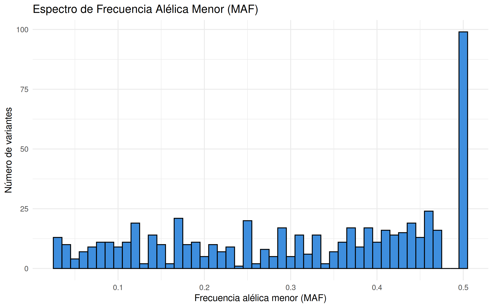
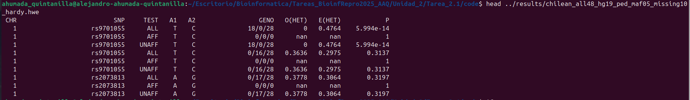
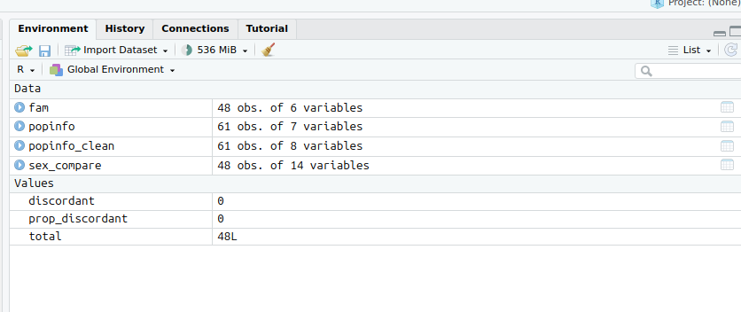
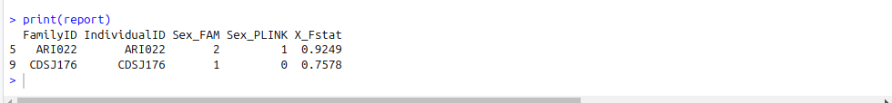
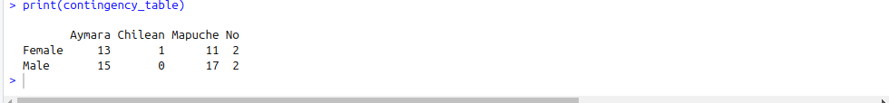

# Tarea 2.1

## Primera parte

### ¿Cuántos individuos y variantes (SNPs) tiene el archivo?

```
vcftools --vcf /datos/compartido/ChileGenomico/GATK_ChGdb_recalibrated.autosomes.12262013.snps.known.vcf 
```

Tiene 18 individuos y 4450360 SNPs


### ¿Cuántos sitios del archivo no tienen datos perdidos?

```
vcftools --vcf /datos/compartido/ChileGenomico/GATK_ChGdb_recalibrated.autosomes.12262013.snps.known.vcf --max-missing 1 --out ../results/Datos_perdidos
```

Hay 382626 datos que no tienen datos perdidos


### Genera un archivo en tu carpeta de trabajo Prac_Uni5/data que contenga solo SNPs en una ventana de 2Mb en cualquier cromosoma. Nombra el "" donde es número del cromosoma, es el inicio de la ventana genómica y es el final en megabases.

```
vcftools --vcf /datos/compartido/ChileGenomico/GATK_ChGdb_recalibrated.autosomes.12262013.snps.known.vcf --chr 4 --from-bp 0 --to-bp 2000000 --recode -c > ../results/CLG_Chr4_0bp-2Mb.vcf
```


### Reporta cuántas variantes tienen el archivo generado

```
vcftools --vcf ../results/CLG_Chr4_0bp-2Mb.vcf 
```

Tiene en total 2355 variantes


### Reporta la cobertura promedio para todos los individuos del set de datos

```
vcftools --vcf ../results/CLG_Chr4_0bp-2Mb.vcf --depth --out ../results/profundidad_Chr4_0-2Mb
```


### Calcula la frecuencia de cada alelo para todos los individuos dentro del archivo y guarda el resultado en un archivo

```
vcftools --vcf ../results/CLG_Chr4_0bp-2Mb.vcf --freq --out ../results/CLG_Chr4_0bp-2Mb_Frecuencias
```


### Filtra el archivo de frecuencias para solo incluir variantes bialélicas (tip: awk puede ser útil para realizar esta tarea, tip2: puedes usar bcftools para filtrar variantes con más de dos alelos antes de calcular las frecuencias)

```
vcftools --vcf ../results/CLG_Chr4_0bp-2Mb.vcf --max-missing 1 --freq --out ../results/CLG_Chr4_0bp-2Mb_no_miss
```


### Llama a un script escrito en lenguaje R que lee el archivo de frecuencias de variantes bialélicas y guarda un histograma con el espectro de MAF para las variantes bialélicas

Se uso el siguiente ocmado de R

```
#Ejecutar el script desde la carpeta code
setwd("/home/ahumada_quintanilla/Escritorio/Bioinformatica/Tareas_BioinfRepro2025_AAQ/Unidad_2/Tarea_2.1/code")

# Cargar librerías
library(ggplot2)
library(readr)
library(dplyr)

# Leer archivo de frecuencias generado por PLINK
freq <- read_table("../results/CLG_Chr4_0bp-2Mb_Frecuencias.frq", comment = "")

colnames(freq)
names(freq)[names(freq) == "{ALLELE:FREQ}"] <- "MAF"
colnames(freq)
freq$MAF_numeric <- as.numeric(sub(".*:", "", freq$MAF))

# Filtrar valores válidos de MAF entre 0 y 0.5
freq_clean <- freq %>%
  filter(MAF_numeric > 0 & MAF_numeric <= 0.5)

# Graficar histograma
p <- ggplot(freq_clean, aes(x = MAF_numeric)) +
  geom_histogram(binwidth = 0.01, fill = "#3E8EDE", color = "black") +
  labs(title = "Espectro de Frecuencia Alélica Menor (MAF)",
       x = "Frecuencia alélica menor (MAF)",
       y = "Número de variantes") +
  theme_minimal()

# Guardar la figura como PNG
ggsave("../results/histogram.png", plot = p, width = 8, height = 5, dpi = 300)
```



### ¿Cuántos sitios tienen una frecuencia del alelo menor <0.05?

```
vcftools --vcf ../results/CLG_Chr4_0bp-2Mb.vcf --max-maf 0.05 --out ../results/CLG_Chr4_0bp-2Mb_frecuencia_menor_0.05
```

En total son 344 sitios


### Calcula la heterocigosidad de cada individuo.

```
vcftools --vcf ../results/CLG_Chr4_0bp-2Mb.vcf --het --out ../results/heterocigosidad_CLG_Chr4_0bp-2Mb
```


### Calcula la diversidad nucleotídica por sitio.

```
vcftools --vcf ../results/CLG_Chr4_0bp-2Mb.vcf --site-pi --out ../results/n,pi_CLG_Chr4_0bp-2Mb
```


### Filtra los sitios que tengan una frecuencia del alelo menor <0.05

```
vcftools --vcf ../results/CLG_Chr4_0bp-2Mb.vcf --max-maf 0.05 --out ../results/CLG_Chr4_0bp-2Mb_frecuencia_menor_0.05
```

En total son 344 sitios


### Convierte el archivo wolves_maf05.vcf a formato plink.

```
vcftools --vcf ../results/CLG_Chr4_0bp-2Mb.vcf --plink --out ../results/plinkCLG_Chr4_0bp-2Mb
```


## Segunda parte

### Enlista los archivos plink que hay en data. ¿Qué tipos de archivos son cada uno?


Aqui se pueden observar archivos .vcf, .bed, .bim, .fam, .csv. Siendo estos ultimos 4 archivos para ser usados con el programa plink

### Consulta el manual de plink1.9 y contesta utilizando comandos de plink lo siguiente. Deposita cualquier arquico que generes an una carpeta Unididad2/Prac_Uni5/results:

### a) Transforma de formato bed a formato ped (pista: sección Data Managment). El nombre del output debe ser igual, solo cambiando la extensión.

usando el comado: 

```
plink --bfile ../data/ChileGenomico/chilean_all48_hg19 --recode --out ../results/chilean_all48_hg19_ped
```

se convirtio a formato ped


### b) Crea otro archivo ped (ojo PPPPed) pero esta vez filtrando los SNPs cuya frecuencia del alelo menor sea menor a 0.05 Y filtrando los individuos con más de 10% missing data. Tu output debe llamarse maicesArtegaetal2015_maf05_missing10

Usando el comando

```
plink --bfile ../data/ChileGenomico/chilean_all48_hg19 --recode --maf 0.05 --mind 0.1 --out ../results/chilean_all48_hg19_ped_maf05_missing10
```

#### ¿Cuántos SNPs y cuántos individuos fueron removidos por los filtros?

se uso el codigo 

```
ahumada_quintanilla@alejandro-ahumada-quintanilla:~/Escritorio/Bioinformatica/Tareas_BioinfRepro2025_AAQ/Unidad_2/Tarea_2.1/code$                                                       echo $(( $(awk '{print (NF - 6)/2; exit}' ../results/chilean_all48_hg19_ped.ped) - $(awk '{print (NF - 6)/2; exit}' ../results/chilean_all48_hg19_ped_maf05_missing10.ped) ))
```

Se quitaron en total 347070 SNPs


### c) Realiza un reporte de equilibrio de Hardy-Weinberg sobre el archivo chilean_all48_hg19_maf05_missing10 creado en el ejercicio anterior. El nombre del archivo de tu output debe contener chilean_all48_hg19_maf05_missing10.

usnado el comando:

```
plink --file ../results/chilean_all48_hg19_ped_maf05_missing10 --hardy --out ../results/chilean_all48_hg19_ped_maf05_missing10_hardy
```


Con respecto a lo que se observa en las columnas del archivo .hwe generaro, se puede ver el numero de cromosoma, seguido de nombre del SNP, luego el TEST o gurpo al cual se le realizo el estudio, seguido de los alelos A1 y A2. GENO corresponde al genotipo. O(HET) es la frecuencia observada de los heterocigotos, E(HET) es la frecuencia esperada de los heterocigotos deacuerdo al analisis de HWE
y por ultimo aparece el valor p de la prueba HWE


### d) Observa el archivo maicesArtegaetal2015.fam. Consulta la documentación de plink para determinar que es cada columna. ¿Qué información hay y no hay en este archivo?

Este tipo de archivo tiene los siguientes 6 campos:

    1) Family ID ('FID')
    2) Within-family ID ('IID'; cannot be '0')
    3) Within-family ID of father ('0' if father isn't in dataset)
    4) Within-family ID of mother ('0' if mother isn't in dataset)
    5) Sex code ('1' = male, '2' = female, '0' = unknown)
    6) Phenotype value ('1' = control, '2' = case, '-9'/'0'/non-numeric = missing data if case/control)

Este archivo omite el nombre de las columnas

### Utiliza la info el archivo data/chilean_all48_hg19_popinfo.csv y el comando update-ids de plink para cambiar los nombres de las muestras de data/chilean_all48_hg19.fam de tal forma que el family ID corresponda a la info de la columna Categ.Altitud en maizteocintle_SNP50k_meta_extended.txt. Pista: este ejercicio requiere varias operaciones, puedes dividirlas en diferentes scripts de bash o de R y bash. Tu respuesta debe incluir todos los scripts (y deben estar en /code).

no logre realizar este ejercicio

### Realiza un cuna comparación entre el sexo y archivo famvy el popinfo y calcula la proporción de discordancias

Segun el script creado, hay 0 discordancias

```
R
#Ejecutar el script desde la carpeta code
setwd("/home/ahumada_quintanilla/Escritorio/Bioinformatica/Tareas_BioinfRepro2025_AAQ/Unidad_2/Tarea_2.1/code")
#Instalar paquetes
#install.packages("dplyr")
#install.packages("readr")
# Cargar paquetes
library(dplyr)
library(readr)

# Leer archivo FAM
fam <- read.table("../data/ChileGenomico/chilean_all48_hg19.fam", header = FALSE, stringsAsFactors = FALSE)
colnames(fam) <- c("FID", "IID", "PID", "MID", "Sex_fam", "Phenotype")

# Leer archivo de info poblacional
popinfo <- read_csv("../data/ChileGenomico/chilean_all48_hg19_popinfo.csv")


# Normalizar sexo en popinfo a formato numérico PLINK (1 = M, 2 = F)
popinfo_clean <- popinfo %>%
  mutate(Sex_popinfo = case_when(
    Sex %in% c("M", "Male", "MALE") ~ 1,
    Sex %in% c("F", "Female", "FEMALE") ~ 2,
    TRUE ~ 0  # desconocido o no especificado
  ))

# Unir ambos datasets
sex_compare <- fam %>%
  inner_join(popinfo_clean, by = c("IID" = "IndID"))

# Comparar
sex_compare <- sex_compare %>%
  mutate(Discordant = ifelse(Sex_fam != Sex_popinfo, 1, 0))


# Calcular proporción
total <- nrow(sex_compare)
discordant <- sum(sex_compare$Discordant)
prop_discordant <- discordant / total

# Mostrar resultado
cat("Total de muestras comparadas:", total, "\n")
cat("Número de discordancias de sexo:", discordant, "\n")
cat("Proporción de discordancias:", round(prop_discordant, 4), "\n")
```



### Realiza un test de estimación de sexo usando plink y reporta los resultados en formato de tabla para todos los individuos con discordancia entre el sexto reportado en fam y el calculado con plink.

para esto se utilizo el comando

```
#Ejecutar el script desde la carpeta code
setwd("/home/ahumada_quintanilla/Escritorio/Bioinformatica/Tareas_BioinfRepro2025_AAQ/Unidad_2/Tarea_2.1/code")
# Leer archivo generado por PLINK
sexcheck <- read.table("../results/chilean_all48_hg19_sex_check.sexcheck", header = TRUE)

# Filtrar los que tienen discordancia
discordant <- subset(sexcheck, STATUS == "PROBLEM")

# Seleccionar columnas clave para el reporte
report <- discordant[, c("FID", "IID", "PEDSEX", "SNPSEX", "F")]

# Renombrar columnas para claridad
colnames(report) <- c("FamilyID", "IndividualID", "Sex_FAM", "Sex_PLINK", "X_Fstat")

# Guardar como CSV para revisión
write.csv(report, "../results/sex_discordances_report.csv", row.names = FALSE)

  # Mostrar resumen por consola
cat("Número de individuos con discordancia de sexo:", nrow(report), "\n\n")
print(report)
```



### Genera una tabla de contingencia de individuos por sexo y ancestría (hint: ver columna Ancestry en el archivo popinfo)

se uso el siguiente comando de r    

```
#Ejecutar el script desde la carpeta code
setwd("/home/ahumada_quintanilla/Escritorio/Bioinformatica/Tareas_BioinfRepro2025_AAQ/Unidad_2/Tarea_2.1/code")

# Cargar librerías necesarias
library(readr)
library(dplyr)

# Leer el archivo popinfo
popinfo <- read_csv("../data/ChileGenomico/chilean_all48_hg19_popinfo.csv")

# Estandarizar valores de sexo si es necesario
popinfo <- popinfo %>%
  mutate(Sex_clean = case_when(
    Sex %in% c("M", "Male", "MALE") ~ "Male",
    Sex %in% c("F", "Female", "FEMALE") ~ "Female",
    TRUE ~ "Unknown"
  ))

# Crear tabla de contingencia: conteo por sexo y ancestría
contingency_table <- table(popinfo$Sex_clean, popinfo$Ancestry)

# Mostrar en consola
print(contingency_table)
```


