# Tarea 2.1
## Primera parte
### ¿Cuántos individuos y variantes (SNPs) tiene el archivo?

```
vcftools --vcf /datos/compartido/ChileGenomico/GATK_ChGdb_recalibrated.autosomes.12262013.snps.known.vcf 
```

Tiene 18 individuos y 4450360 SNPs
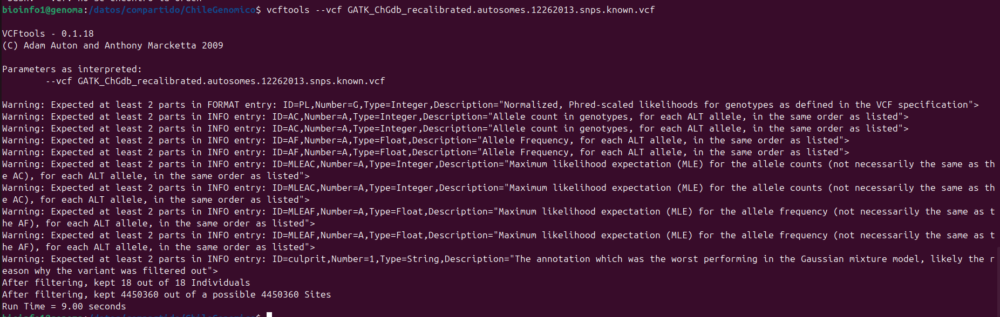

### ¿Cuántos sitios del archivo no tienen datos perdidos?

```
vcftools --vcf /datos/compartido/ChileGenomico/GATK_ChGdb_recalibrated.autosomes.12262013.snps.known.vcf --max-missing 1 --out ../results/Datos_perdidos
```

Hay 382626 datos que no tienen datos perdidos
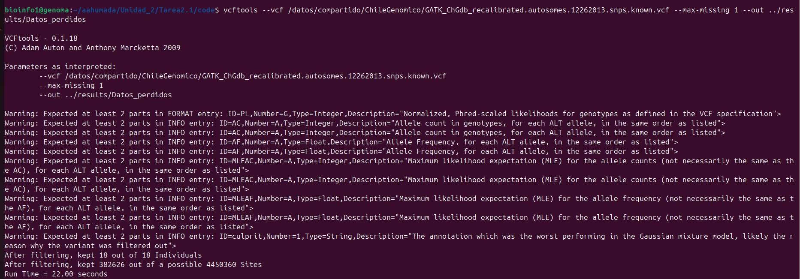

### Genera un archivo en tu carpeta de trabajo Prac_Uni5/data que contenga solo SNPs en una ventana de 2Mb en cualquier cromosoma. Nombra el "" donde es número del cromosoma, es el inicio de la ventana genómica y es el final en megabases.

```
vcftools --vcf /datos/compartido/ChileGenomico/GATK_ChGdb_recalibrated.autosomes.12262013.snps.known.vcf --chr 4 --from-bp 0 --to-bp 2000000 --recode -c > ../results/CLG_Chr4_0bp-2Mb.vcf
```

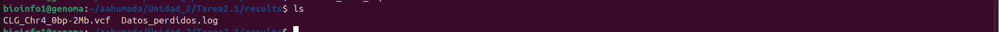

### Reporta cuántas variantes tienen el archivo generado

```
vcftools --vcf ../results/CLG_Chr4_0bp-2Mb.vcf 
```

Tiene en total 2355 variantes
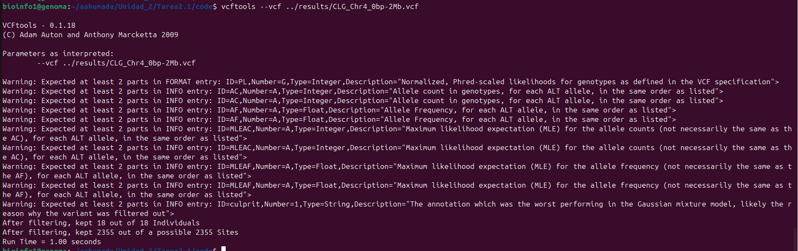

### Reporta la cobertura promedio para todos los individuos del set de datos

```
vcftools --vcf ../results/CLG_Chr4_0bp-2Mb.vcf --depth --out ../results/profundidad_Chr4_0-2Mb
```

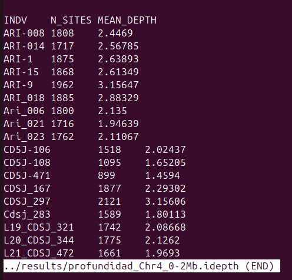

### Calcula la frecuencia de cada alelo para todos los individuos dentro del archivo y guarda el resultado en un archivo

```
vcftools --vcf ../results/CLG_Chr4_0bp-2Mb.vcf --freq --out ../results/CLG_Chr4_0bp-2Mb_Frecuencias
```

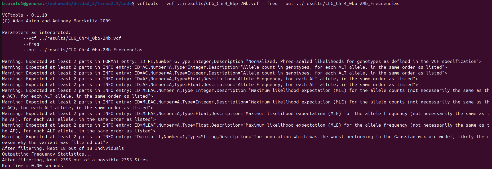

### Filtra el archivo de frecuencias para solo incluir variantes bialélicas (tip: awk puede ser útil para realizar esta tarea, tip2: puedes usar bcftools para filtrar variantes con más de dos alelos antes de calcular las frecuencias)

```
vcftools --vcf ../results/CLG_Chr4_0bp-2Mb.vcf --max-missing 1 --freq --out ../results/CLG_Chr4_0bp-2Mb_no_miss
```

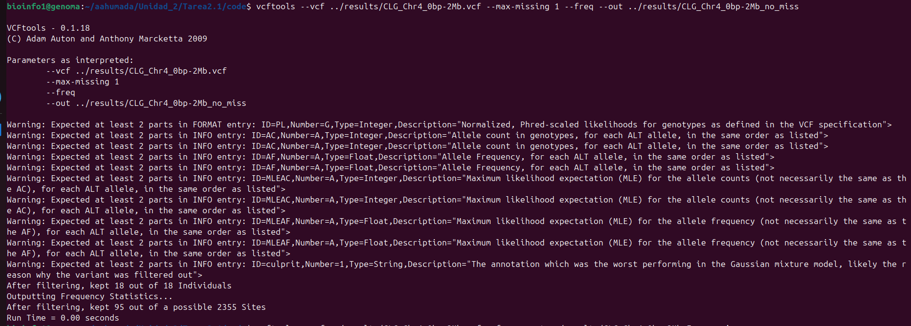

### Llama a un script escrito en lenguaje R que lee el archivo de frecuencias de variantes bialélicas y guarda un histograma con el espectro de MAF para las variantes bialélicas

### ¿Cuántos sitios tienen una frecuencia del alelo menor <0.05?

```
vcftools --vcf ../results/CLG_Chr4_0bp-2Mb.vcf --max-maf 0.05 --out ../results/CLG_Chr4_0bp-2Mb_frecuencia_menor_0.05
```

En total son 344 sitios
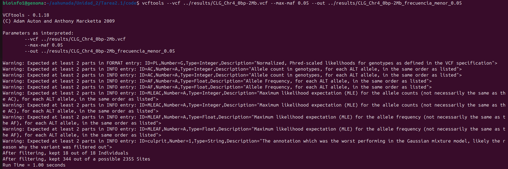

### Calcula la heterocigosidad de cada individuo.

```
vcftools --vcf ../results/CLG_Chr4_0bp-2Mb.vcf --het --out ../results/heterocigosidad_CLG_Chr4_0bp-2Mb
```

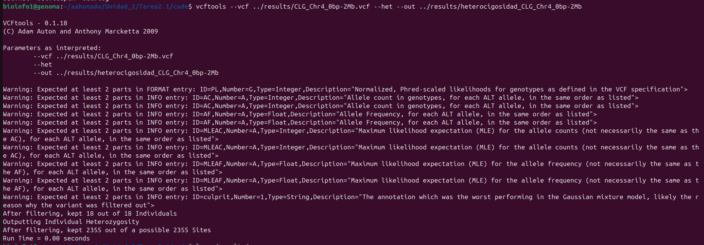

### Calcula la diversidad nucleotídica por sitio.

```
vcftools --vcf ../results/CLG_Chr4_0bp-2Mb.vcf --site-pi --out ../results/n,pi_CLG_Chr4_0bp-2Mb
```

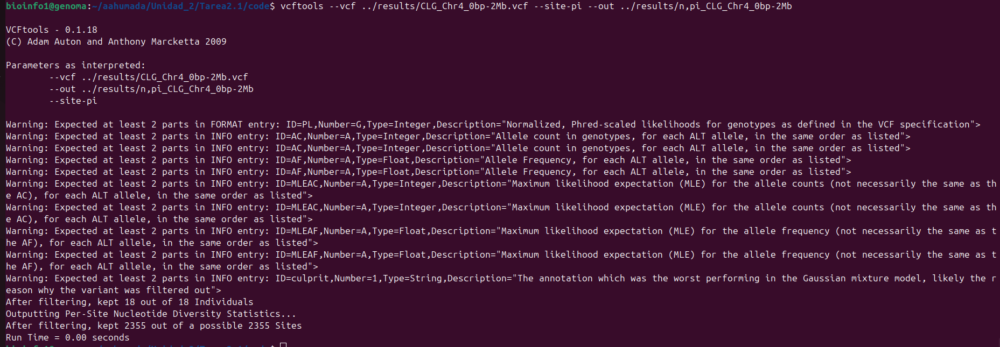

### Filtra los sitios que tengan una frecuencia del alelo menor <0.05

```
vcftools --vcf ../results/CLG_Chr4_0bp-2Mb.vcf --max-maf 0.05 --out ../results/CLG_Chr4_0bp-2Mb_frecuencia_menor_0.05
```

En total son 344 sitios


### Convierte el archivo wolves_maf05.vcf a formato plink.

```
vcftools --vcf ../results/CLG_Chr4_0bp-2Mb.vcf --plink --out ../results/plinkCLG_Chr4_0bp-2Mb
```

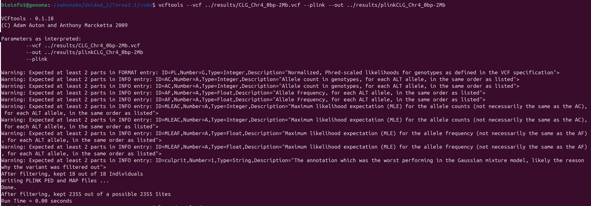


## Segunda parte
### Enlista los archivos plink que hay en data. ¿Qué tipos de archivos son cada uno?
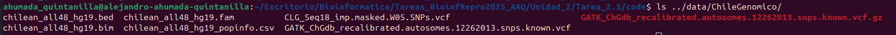
Aqui se pueden observar archivos .vcf, .bed, .bim, .fam, .csv. Siendo estos ultimos 4 archivos para ser usados con el programa plink

### Consulta el manual de plink1.9 y contesta utilizando comandos de plink lo siguiente. Deposita cualquier arquico que generes an una carpeta Unididad2/Prac_Uni5/results:

### a) Transforma de formato bed a formato ped (pista: sección Data Managment). El nombre del output debe ser igual, solo cambiando la extensión.
usando el comado: 
```
plink --bfile ../data/ChileGenomico/chilean_all48_hg19 --recode --out ../results/chilean_all48_hg19_ped
```
se convirtio a formato ped
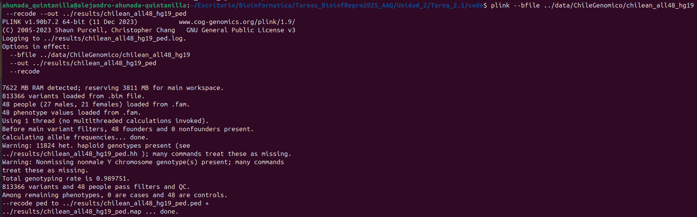

### b) Crea otro archivo ped (ojo PPPPed) pero esta vez filtrando los SNPs cuya frecuencia del alelo menor sea menor a 0.05 Y filtrando los individuos con más de 10% missing data. Tu output debe llamarse maicesArtegaetal2015_maf05_missing10

Usando el comando
```
plink --bfile ../data/ChileGenomico/chilean_all48_hg19 --recode --maf 0.05 --mind 0.1 --out ../results/chilean_all48_hg19_ped_maf05_missing10
```
#### ¿Cuántos SNPs y cuántos individuos fueron removidos por los filtros?
se uso el codigo 
```
ahumada_quintanilla@alejandro-ahumada-quintanilla:~/Escritorio/Bioinformatica/Tareas_BioinfRepro2025_AAQ/Unidad_2/Tarea_2.1/code$                                                       echo $(( $(awk '{print (NF - 6)/2; exit}' ../results/chilean_all48_hg19_ped.ped) - $(awk '{print (NF - 6)/2; exit}' ../results/chilean_all48_hg19_ped_maf05_missing10.ped) ))
```
Se quitaron en total 347070 SNPs
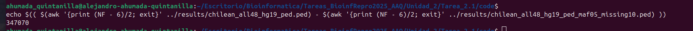


### c) Realiza un reporte de equilibrio de Hardy-Weinberg sobre el archivo chilean_all48_hg19_maf05_missing10 creado en el ejercicio anterior. El nombre del archivo de tu output debe contener chilean_all48_hg19_maf05_missing10.
usnado el comando:
```
plink --file ../results/chilean_all48_hg19_ped_maf05_missing10 --hardy --out ../results/chilean_all48_hg19_ped_maf05_missing10_hardy
```
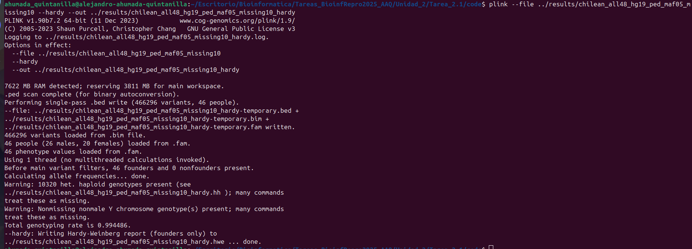
