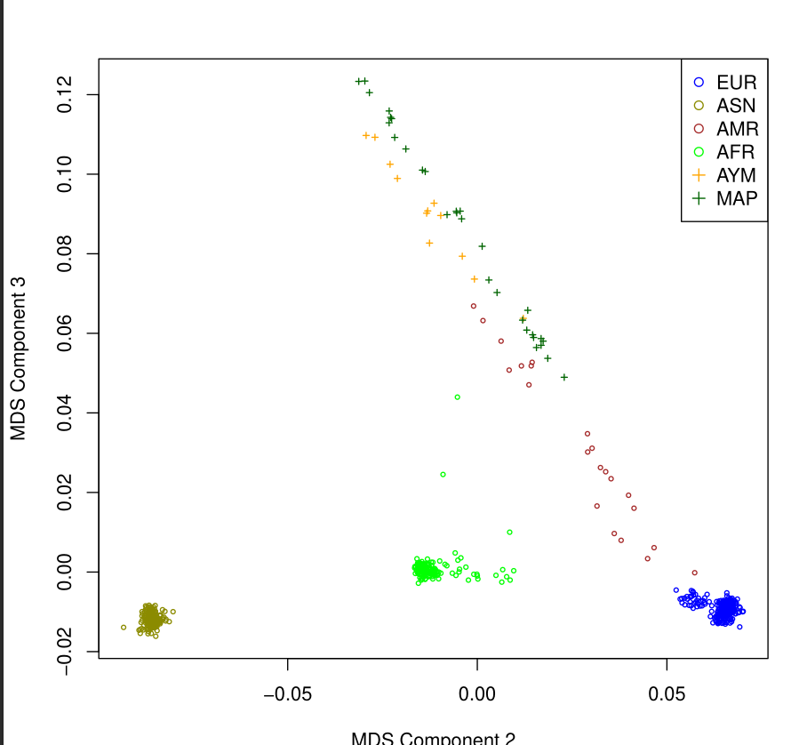
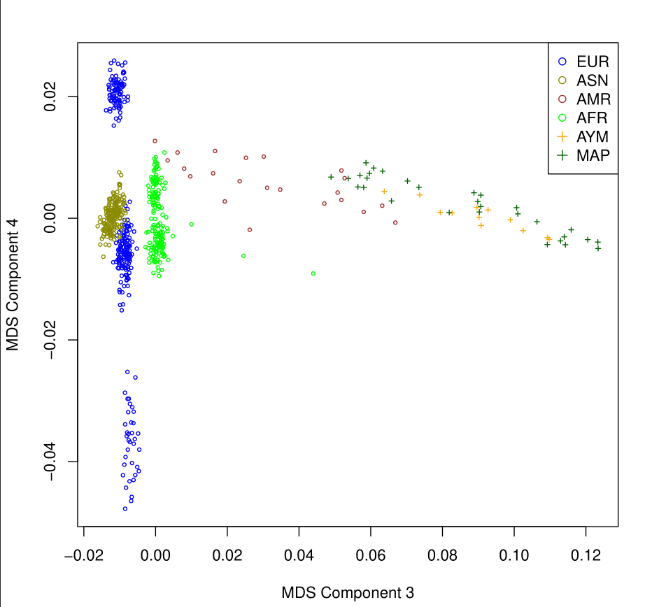

# Tarea 2.2

## Paso 1

1) ¿Cómo se llaman los archivos que contienen las tasas de datos perdidos por SNP y por muestra?
   se llaman plink.imiss y plink.lmiss

2) ¿Cuántas variantes se eliminaron por tener una tasa de datos perdidos mayor a 0.2?
   Se uso:
   
   ```
   wc -l $C/chilean_all48_hg19.bim 
   wc -l chilean_all48_hg19_3.bim
   ```
   
   Se obtubo: 813366 y 808686 respectivamente
   lo cual da un total de 4680 datos eliminados

3) ¿Cuántos individuos tenían una tasa de datos perdidos mayor a 0.02?
   Se uso: 
   
   ```
   wc -l $C/chilean_all48_hg19.bim
   wc -l chilean_all48_hg19_5.bim
   ```
   
   Se obtuvo: 813366 y 574624 respectivamente
   se obtubieron en total 238742 individuos con datos perdidos mayor a 0.02

4) Basados en los histogramas y en sus cálculos, ¿qué valores umbrales de datos perdidos para muestras y SNPs sugeriría?
   para el primer histograma se recomendaria un umbral de 0.05 de datos predidos y para el segundo, seria alrededor de 0.1

## Paso 2

1) ¿Cuántos individuos fueron eliminados por discrepancia de sexo?
   ARI022 ARI022
   CDSJ176 CDSJ176
   CDSJ118 CDSJ118
   se eliminaron estos individuos
2) ¿Qué riesgo(s) se corre(n) si no se eliminaran?
   Se corre el riesgo de que en analisis posteriores los codigos arrojen errores debido a estas discrepancias

## Paso 3

1) ¿Cuál es el nombre del primer conjunto de datos que solo contiene SNPs en autosomas?
   se llaman chilean_all48_hg19_7 (.bed, .bim, .fam, .log)

2) ¿Cuántos SNPs se encontraban en cromosomas sexuales?
   usando: 
   
   ```
   wc -l chilean_all48_hg19_6.bim
   wc -l chilean_all48_hg19_7.bim
   ```
   
   se obtuvieron 574624 y 557922 respectivamente
   por lo tanto habian 16702 SNPs en los cormosomas sexuales

3) ¿Como calcularía el número de cromosomas que porta cada uno de los alelos para cada SNP?
   Para esto se puede utilizar el siguiente comando: 
   
   ```
   awk 'NR > 1 { 
   >   total = $6
   >   freqA1 = $5
   >   countA1 = int(freqA1 * total + 0.5)
   >   countA2 = total - countA1
   >   print $2, $3, countA1, $4, countA2
   > }' MAF_check.frq > conteo_alelos.txt
   ```

## Paso 4

1) ¿Cuál es el nombre del archivo con los resultados de la prueba de HWE?
   su nombre es plink.hwe y chilean_all48_hg19_9 (.bed, .bim, .fam)
2) ¿Basándose en la distribución de los valores de p, le parece el umbral usado razonable o propondría otro valor?
   si estoy de acuerdo con el valor p elegido, esta dentro de rango recomendado

## Paso 5

1) ¿Cuántos SNPs en aparente equilibrio de ligamiento se encontraron?
   se encontraron 103214
   
   ```
   wc -l indepSNP.prune.in
   ```

2) ¿Cuántos SNPs se eliminaron por estar en regiones de inversiones conocidas?
   se eliminaron en tota 346968
   
   ```
   wc -l indepSNP.prune.out
   ```

3) ¿Cuántos individuos quedaron luego del filtro de parentesco?
   Quedaron 458097 
   usando el comando 
   
   ```
   wc -l chilean_all48_hg19_10.bim
   ```

4) ¿Cuál fue el mayor coeficiente de parentesco efectivamente aceptado?
   el mayor fue de 0.2005

# Parte 2

Sin preguntas

# Parte 3
## Paso 3
Usando el codigo:

```R
data<- read.table(file="MDS_merge2.mds",header=TRUE)
race<- read.table(file="ethnicityfile.txt",header=TRUE)
datafile<- merge(data,race,by=c("IID"))
head(datafile)

pdf("MDS_2_3.pdf",width=7,height=7)

datafile$color <- sapply(as.character(datafile$ethnicity), switch,
                     EUR="blue",
                     ASN="yellow4",
                     AMR="brown",
                     AFR="green",
                     AYM="orange",
                     MAP="darkgreen")

datafile$pch <- ifelse(datafile$ethnicity %in% c("AYM", "MAP"), 3, 1)

plot(datafile[,5],datafile[,6],type="p", xlab="MDS Component 2", ylab="MDS Component 3",pch=datafile$pch, cex=0.5, col=datafile$color)

legend("topright", pch=c(1,1,1,1,3,3),c("EUR","ASN","AMR","AFR","AYM","MAP"),col=c("blue","yellow4","brown","green", "orange","darkgreen"),bty="o",cex=1)
```

Se obtuvo el siguiente grafico para el componente 2 y 3


Luego usando:

```R
data<- read.table(file="MDS_merge2.mds",header=TRUE)
race<- read.table(file="ethnicityfile.txt",header=TRUE)
datafile<- merge(data,race,by=c("IID"))
head(datafile)

pdf("MDS_3_4.pdf",width=7,height=7)

datafile$color <- sapply(as.character(datafile$ethnicity), switch,
                     EUR="blue",
                     ASN="yellow4",
                     AMR="brown",
                     AFR="green",
                     AYM="orange",
                     MAP="darkgreen")

datafile$pch <- ifelse(datafile$ethnicity %in% c("AYM", "MAP"), 3, 1)

plot(datafile[,6],datafile[,7],type="p", xlab="MDS Component 3", ylab="MDS Component 4",pch=datafile$pch, ce=0.5, col=datafile$color)

legend("topright", pch=c(1,1,1,1,3,3),c("EUR","ASN","AMR","AFR","AYM","MAP"),col=c("blue","yellow4","brown","green", "orange","darkgreen"),bty="o",cex=1)
```

Se obtuvo el siguiente grafico para el componente 3 y 4


Se observa que de acuerdo al componente elegido los datos se agrupan de formas diferentes en las 3 combinaciones probadas. Es probable que si seleccionamos mal estos componentes nos arroje resultados erroneos con respecto a la ansestria de los individuos

## Paso 4

1) ¿Cuántos SNPs quedaron luego del filtro?
Usando:
```
wc -l MDS_merge_r2_lt_0.2.K3.log
```
Solo quedaron 50 SNPs

2) ADMIXTURE asume que los individuos no están emparentados. Sin embargo, no realizamos ningún filtro. ¿Por qué?
Esto se debe a que en los analisis realizados con ADMIXTURE la presencia o ausencia de estos parentesco en esta muestra no alterara los resultados finales del analisis

