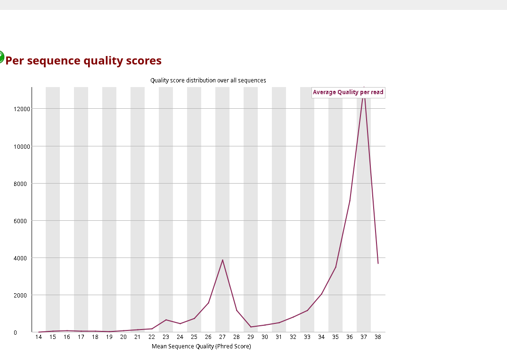

# Tarea 3.1

Alejandro Ahumada Quintanilla

1) Usando comandos Unix:
- Contar el número de lecturas (reads) en un archivo fastq
  Se uso el comando
  
  ```
  wc -l ~/181004_curso_calidad_datos_NGS/fastq_raw/S3_R1.fastq.gz
  wc -l ~/181004_curso_calidad_datos_NGS/fastq_raw/S3_R2.fastq.gz
  ```
  
  

dado que en cada lectura se utilizan 4 lineas, el resultado se dividio por 4, por lo tanto:
Para R1: 26404/4= 6601 lecturas
Para R2: 32046/4= 8011 lecturas

- Previsualizar las primeras 40 líneas del mismo archivo fastq
  Para esto se uso el comando
  
  ```
  zcat ~/181004_curso_calidad_datos_NGS/fastq_raw/S3_R1.fastq.gz | head -n 40
  zcat ~/181004_curso_calidad_datos_NGS/fastq_raw/S3_R2.fastq.gz | head -n 40
  ```
  
  
  

- Ubicar la lectura 3 e identificar la información disponible. Describir en detalle la información entregada. ¿Donde se entrega la calidad del read?, ¿Cuál es el ID (identificador) del read? Etc. Utilice fechas y etiquetas para identificar cada parte.
  Tercera lectura del R1:
  @M03564:2:000000000-D29D3:1:1101:16551:1405 1:N:0:ATCACGAC+TAAGACAC
  AAGCTGACAGCTACTCCAACACCTTTGGGTGGTATGACTGGTTTCCACATGCAAACTGAAGATCGAACTATGAAAAGTGTTAATGACCAGCCATCTGGAAATCTTCCATTTTTAAAACCTGATGATATTCAATACTTTGATAAACTATTGGTAAGTGATACTAGCAGAAATAAACTATTAATTGTGTTCCAGAATTATAAATCATAACATTTCAACTTCCCTTAACAGCGAATTTCGACGATCGTTGCATT
  +
  CCBCCFFFFFCFGGGGGGGGGGGHHHHHGEFGGHHHHHHHHHHHHHHHHHHHHHHHHHGHHHHHHGHHHHHHHHHHHHHHHHHHHHHHHHHGHHHHHHHHHHHHHHHHHHHHHHHHHHGHHHHHHHIHHHHHIHHHHHHHHHHGHHHHHHHHHHHHHHHHHHHHHHHGHHHHHHHHHHHHHHHHHHHHHHHHHHHHHHHHHHHGHHHHHHHHHHHHHHHHGHHHHGHDFGGGGHHHFEGFGFGGFGGGGG0

En la imagen se detallan las partes de esta lectura
  
Tercera lectura de R2:
@M03564:2:000000000-D29D3:1:1101:16551:1405 2:N:0:ATCACGAC+TAAGACAC
TGTTAAGGGAAGTTGAAATGTTATGATTTATAATTCTGGAACACAATTAATAGTTTATTTCTGCTAGTATCACTTACCAATAGTTTATCAAAGTATTGAATATCATCAGGTTTTAAAAATGGAAGATTTCCAGATGGCTGGTCATTAACACTTTTCATAGTTCGATCTTCAGTTTGCATGTGGAAACCAGTCATACCACCCAAAGGTGTTGGAGTAGCTGTCAGCTTAGATCGGAAGAGCGTCGTGTAGGG
+
CCCCCFFFFCFBGGGGGGGGGGHGHHHHHGHHHHHHHHHHHHHHHGHHFGHHHFHHHHHGHHHHHHHHHHHHHHHHHHGHHHHHHHGHHHHHHHHHHHHHHHHHHHHHHGGGHEHHHHHHHEHHHHHHHHHHHHHHFHHGGHGHHHHHHHHHHHHHFHHGHHHGHHHHHHHHGHGHHGFFGH2DHHHHHGHHGHHHGFFGCGHFHB11?<G.GFGGDGHHHHHH1>F<GFHHEFCEF.<CDDGGCD:G:G.

Esta lectura se estructura de la misma forma que la primera

- Traducir el código de calidad para las primeras 10 bases del tercer read a valores numéricos (Q) usando la codificación entregada en clase.
  Se hizo el supuesto de que la secuenciacion se relalizo con el equipo L - Illumina 1.8 + Phred, raw reads typically (0, 41)
  R1: CCBCCFFFFF
  Se traduce como: 34 34 33 34 34 37 37 37 37 37 
  R2: CCCCCFFFFC
  Se traduce como: 34 34 34 34 34 37 37 37 37 34
2) Genere un informe de calidad con FastQC para una muestra (cada estudiante una muestra distinta), para R1 y R2.
   En priemra instancia se copiaron los datos de S3 en mi repositorio local usando el protocolo de copia segura (scp)
   Se utilizaron los siguientes comandos para obtener el informe
   
   ```
   fastqc ../data/S3_R1.fastq.gz -o ../results/
   fastqc ../data/S3_R2.fastq.gz -o ../results/
   ```
   
   Los resultados fueron
   

3) Baje los archivos HTML a su computados mediante sftp (puede usar cualquier cliente o la línea de comandos. Por ejemplo, ejecutando desde su computador local: scp  bioinfo1@genoma.med.uchile.cl:ricardo/S3_R1_fastqc* .  
   Esta tarea se relizo previamente en el punto 2, ya que en el servidor no me reconocio el comando fastqc, decidi instalarlo en mi pc y descargar los archivos .gz
   De todas formas el codigo usado para copiar los archivos fue:
   
   ```
   scp bioinfo1@genoma.med.uchile.cl:~/181004_curso_calidad_datos_NGS/fastq_raw/S3_R1.fastq.gz ~/Escritorio/Bioinformatica/Tareas_BioinfRepro2025_AAQ/Unidad_3/Tarea_3.1/data
   
   scp bioinfo1@genoma.med.uchile.cl:~/181004_curso_calidad_datos_NGS/fastq_raw/S3_R2.fastq.gz ~/Escritorio/Bioinformatica/Tareas_BioinfRepro2025_AAQ/Unidad_3/Tarea_3.1/data
   ```

4) Analice el informe de calidad creado con fastqc para las lecturas R1 y R2.
   Los resultados fueron los siguientes
   Para R1:
   
   En este primer analisis se puede ver que la calidad de los fragementos es muy buena, por lo tanto la calidad de la secuenciacion no disminuyo tanto con el pasar de los ciclos en las lecturas que se realizaron
   Para R2:
   
   Aca si se observa una disminucion en la calidad de las lecturas por sobre los 210 bp, por lo tanto el programa fastqc nos arroja una señal de advertencia    

5) Compare los valores calculados en el punto 1 con lo entregado en el informe de calidad obtenido con FastQC
   Los valores calculados para los 10 primeros nucleotidos en el punto 1 concuerda con los datos entregados por el analisis fastqc, donde se observa que para el R1 se mantienen esa calidad alta sobre 31, esto se observa en toda la lectura analisada, lo cual concuerda con el analisis entregado por fasqc.
   Para el analisis de R2 cabe destacar que tambien se ve una buena calidad de lectura en los primeros nuncleotidos, pero si nos vamos al final de esa lectura la calidad se ve disminuida (bajo 31), esta observacion concuerda con lo que se observo en el analisis hecho por fastqc

6) Seleccione las 4 figuras más importantes a su criterio para analizar la calidad de la corrida, cópielas a un archivo Markdown en su repositorio y agregue su interpretación de cada figura. Recuerde hacer la comparación de R1 y R2 para las secuencias crudas y las secuencias podadas.
   Para copiar los datos filtrados se uso el comando 

```
scp bioinfo1@genoma.med.uchile.cl:~/181004_curso_calidad_datos_NGS/fastq_filter/S3_R1_filter.fastq.gz /home/ahumada_quintanilla/Escritorio/Bioinformatica/Tareas_BioinfRepro2025_AAQ/Unidad_3/Tarea_3.1/data/
scp bioinfo1@genoma.med.uchile.cl:~/181004_curso_calidad_datos_NGS/fastq_filter/S3_R2_filter.fastq.gz /home/ahumada_quintanilla/Escritorio/Bioinformatica/Tareas_BioinfRepro2025_AAQ/Unidad_3/Tarea_3.1/data/
```

luego se ejecuto fastqc sobre las lecturas podadas

```
fastqc ../data/S3_R1_filter.fastq.gz -o ../results/
fastqc ../data/S3_R2_filter.fastq.gz -o ../results/
```

los resultados obtenidos para los datos filtrados son los siguientes:
  

  
Se puede observar que en ambos casos luego de quitar los adaptadores la calidad de las lecturas mejoró bastanate

Con respecto a las figuras mas importantes, a mi cirterio son las siguientes

## Per base sequence quality

### R1

  

### R1_filter

  

### R2

  

### R2_filter

  

Por lejos esta figura es de las mas importantes ya que evalua la calidad de la lectura base por base, permite saber si la lectura disminuye su calidad en los extremos y determinara si debo o no hacer trimming

## Per Sequence GC Content

### R1

  

### R1_filter

  

### R2

  

### R2_filter

  

 Mide el %GC de cada lectura, me permite detectar alguna contaminacion biologia (otra especie) en la muestra

En estos casos se observa que en todos arroja una alerta, por lo tanto es posible de que exita algun tipo de contaminante en la muestra

## Per sequence quality scores

### R1

  

### R1_filter

  

### R2

  

### R2_filter

  

Muestra la calidad promedio de las lecturas, me permite saber si la mayoria de las lecturas son confiables o no

En todos estos casos se observa una calidad promedio por lectura aceptable

## Adapter Content

### R1

  

### R1_filter

  

### R2

  

### R2_filter

  

Esta figura me permite detectar la presencia de adaptadores o algun otro contaminante que interfiera con mis lecturas

Se ve que arroja la alerta en las graficas que pertenencen a las lecturas brutas, luego del filtro se eliminan los adaptadores, lo cual mejora sustancialmente la calidad de las lecturas
