# Tarea 3.2

## cBioPortal para analizar datos genómicos de cáncer

El estudio seleccionado fue: Hepatocellular Carcinoma (MSK, Clin Cancer Res 2024), este estudio posee un numero total de pacientes de 1370 pacientes. La institucion responsable de este estudio fue: Department of Surgery, Memorial Sloan Kettering Cancer Center, New York, New York.

Es interesante este estudio ya que el cancer de higado es muy comun en personas alcoholicas que llevan años abusando de la sustancia, pero tambien se da en personas con mala alimentacion y que debutan con higado graso, el cual no se cuidan en su debido momento y la patologia es capaz de seguir avanzando, pudiendo ocacionar un cancer de higado en el peor de los casos

Los 5 genes mutados que presentan una mayor frecuencia son:

- TP53
- ARID1A
- TERT
- KRAS
- IDH1
  Las frecuencias de cada uno se detallan en la siguiente figura
  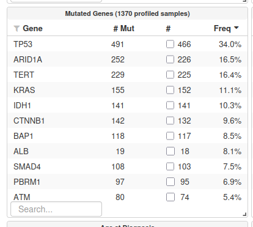

Los graficos antes de seleccionar el gen se veian de la siguiente forma:
  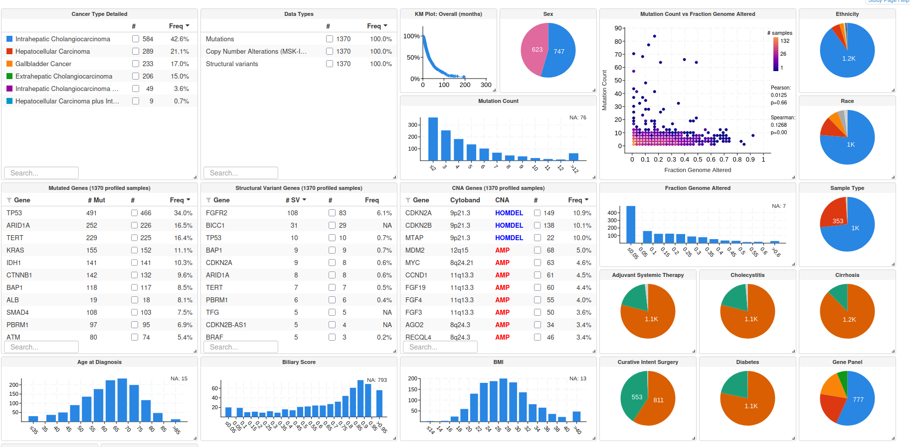

Luego de seleccionar el gen KRAS se ven de la siguiente forma:
  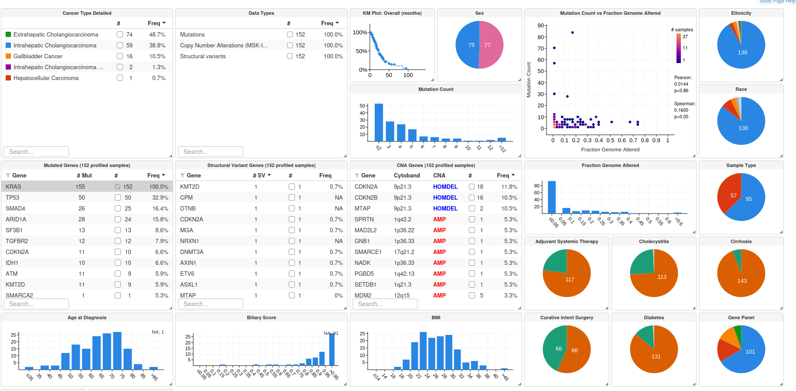

En total 152 pacientes presentan esa mutacion , divididos casi 50/50 entre hombres y mujeres. El tipo de mutacion mas frecuente es la Missense
  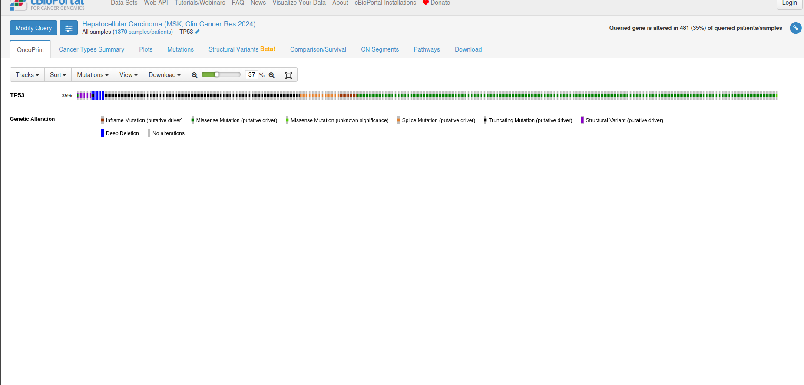

Con respecto a las pathway, aparece alterada la via de señalizacion de RTK-RAS, tal como se ve en la imagen
  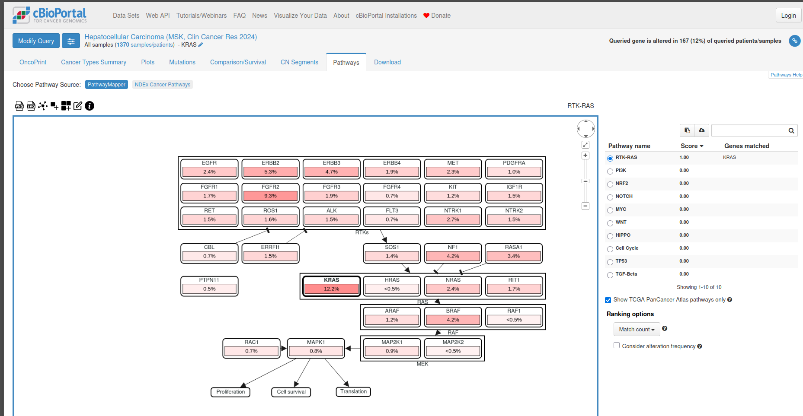

Las distribuciones por sexo, edad y raza se encuentran a continuacion, respectivamente

### Sexo

  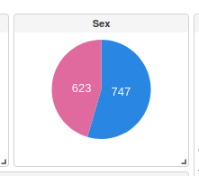

### Edad

Se extrajeron los daots de las edades (se descargaron) y se analizo la menor y mayor edad ordenando los datos de menor a mayor.
  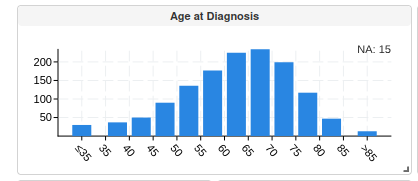
      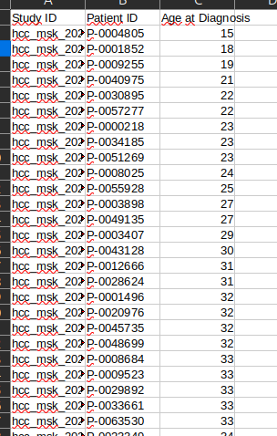
       La edad minima es de 15 años
      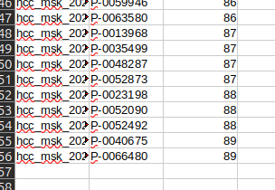
       La edad mas alta fue de 89 años
 Segun los datos extraidos y el calculo realizado en excel la mediana de la edad fue de 64 años de todos los datos de las edades. En la siguiente imagen se observa que los dos grupos se dividen en base a la mediana de los datos, en datos que estan por sobre la mediana y por bajo la mediana
       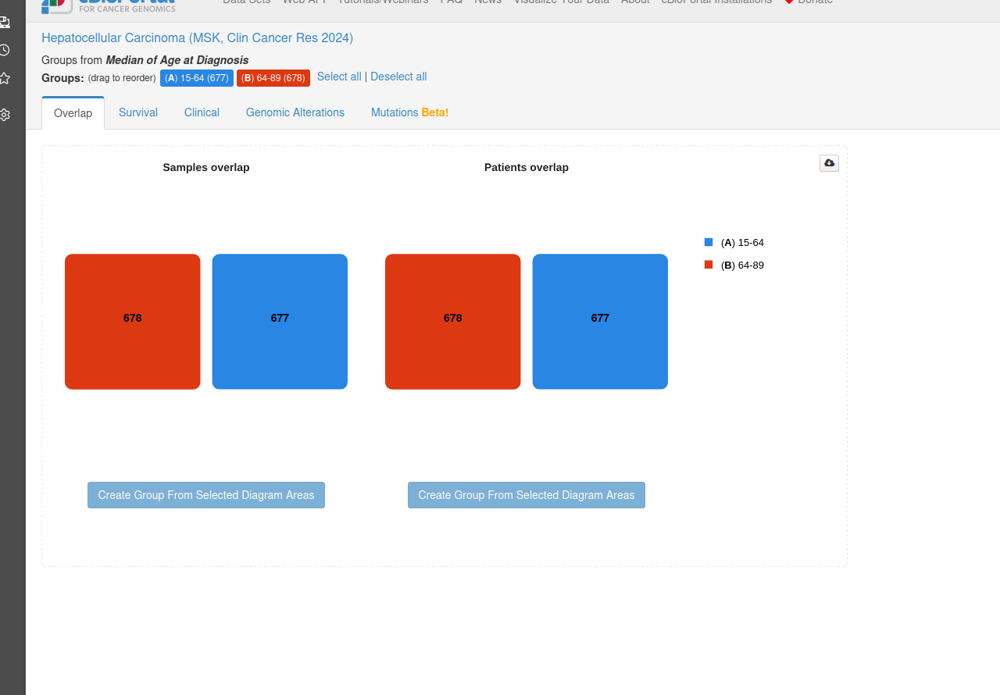

 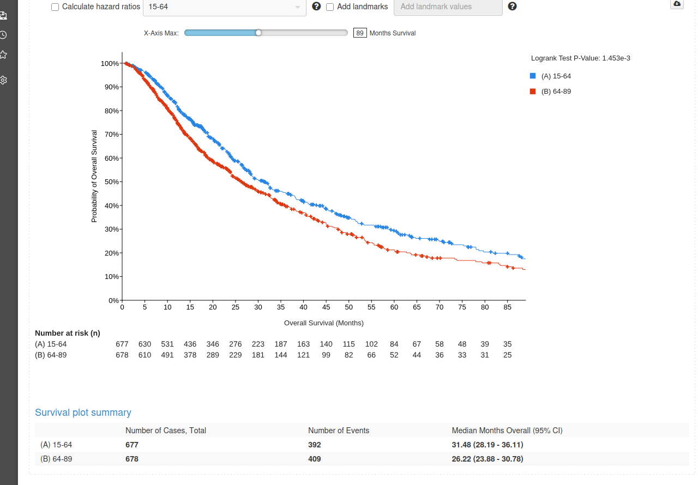

### Raza

  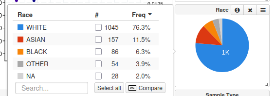

#### Analisis de sexo, edad y raza

Con respecto al sexo no se observa una clara predominancia pero si una tendencia a que el diagnostico se realiza más en hombres que en mujeres, pero es una predominancia no tan grande que puede deberese a multiples factores, habria que entrar a un analsis mas profundo y con mas datos para poder decir algo mas concreto, pero eciste esta tendencia de se mas diagnosticado este tipo de cancer en hombres.

Por edad si exite una predominancia a que se diagnostique mas en personas de 60 y 65 años. Algo que es destacable con respecto a la edad es lo que se observa en la curva de "Survival", aqui se ve que el grupo de personas sobre la mediana (sobre 64 años) presenta una mayor mortalidad con respecto a las personas que estan por debajo de la mediana, no puedo saber si es estadisticamente significativo pero si que se ve esa diferencia a destacar

Esta distrubucion podria tener un efecto a nivel de salud publica para poder focalizar las estrategias en los grupos poblacionales de mayor riesgo y tambien poder enfocar de mejor forma las estrategias de prevencion a nivel poblacional. Seria muy bueno poder repetir un estudio como este a nivel local

# Análisis interpretativo

Con respecto al diagnostico por sexo no se observaron diferencias con el gen seleccionado, ademas se observa que los primeros 4 genes mutados acumulan aproximadamente el 50 % de los casos, por lo tanto estos genes serian unos muy buenos marcadores para poder evaluar al momento del diagnostico de una persona con este tipo de cancer, lo cual podria servir para las estrategias de prevencion, testeando a las personas que se consideren dentro del gurpo de riesgo para prevenir la enfermedad grave y poder actuar a tiempo. Ademas, hay que tomar en considereacion que en este estudio la mayor parte de la poblacion diagnosticada fue de raza Blanca, esto puede deberse a un sesgo inicial del estudio por el lugar en el cual fue realizado el estudio. 

Por ultimo es importante destacar que estos cuatro genes podrian ser buenos candiadtoas como dianas terapeuticas luego de analizar la via de señalizacion en la cual intervienen, se podria restaurar su funcion añadiendo exogenamente la proteina o en el futuro se podria desarrollar la tecnologia para reemplazar el gen dañado por el gen bueno, asi se podria curar la enfermedad
