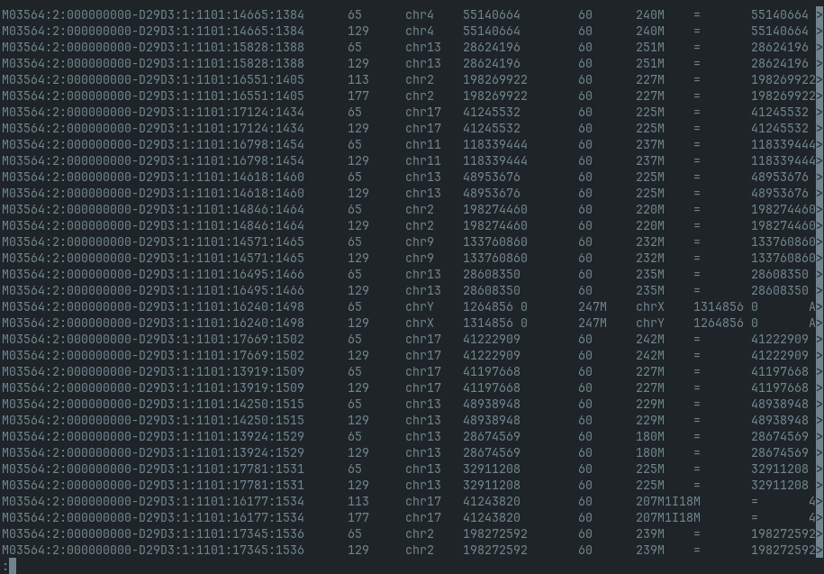
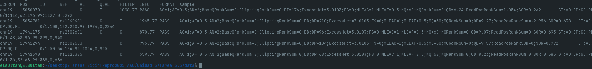
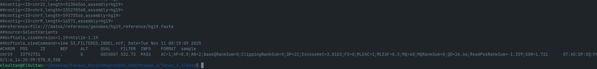
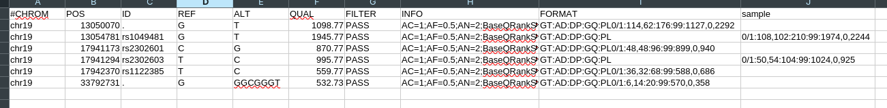
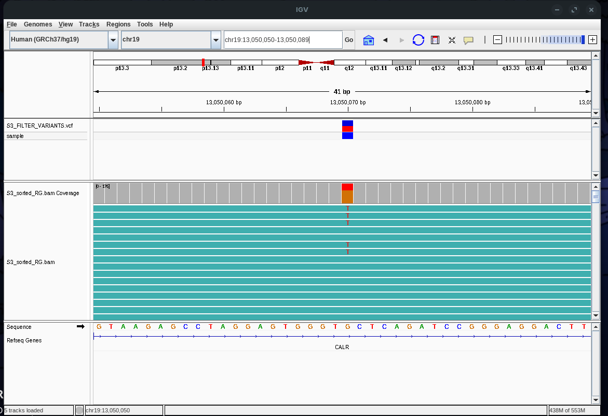
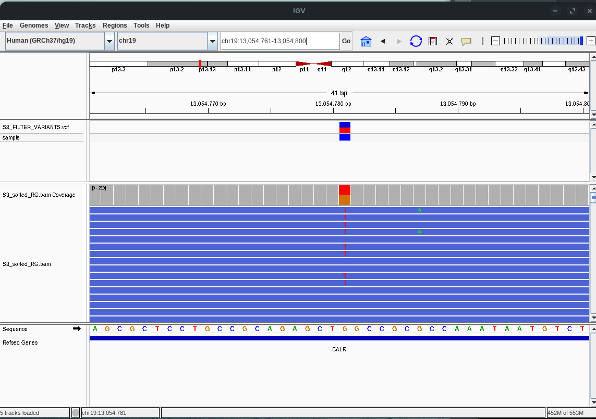
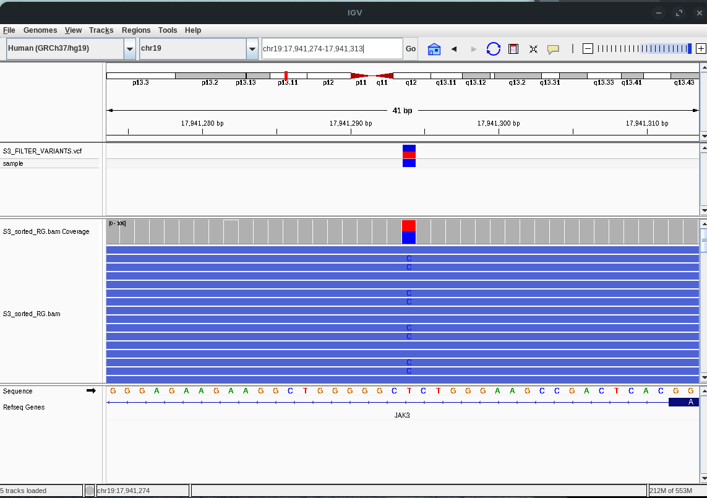
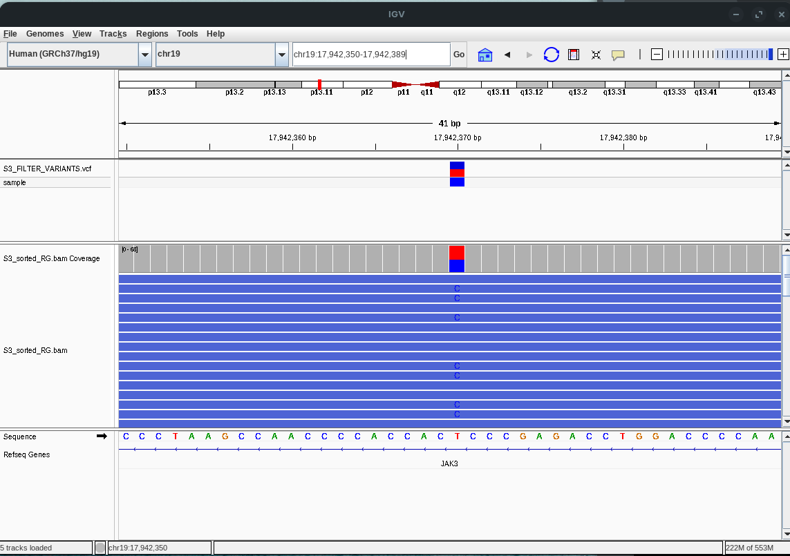
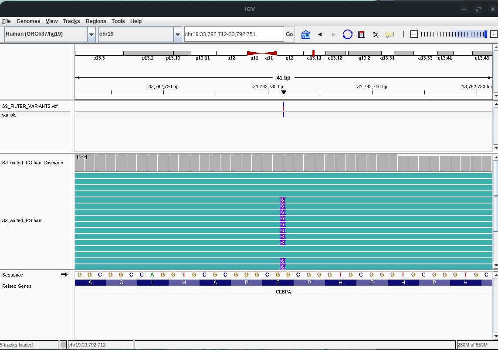
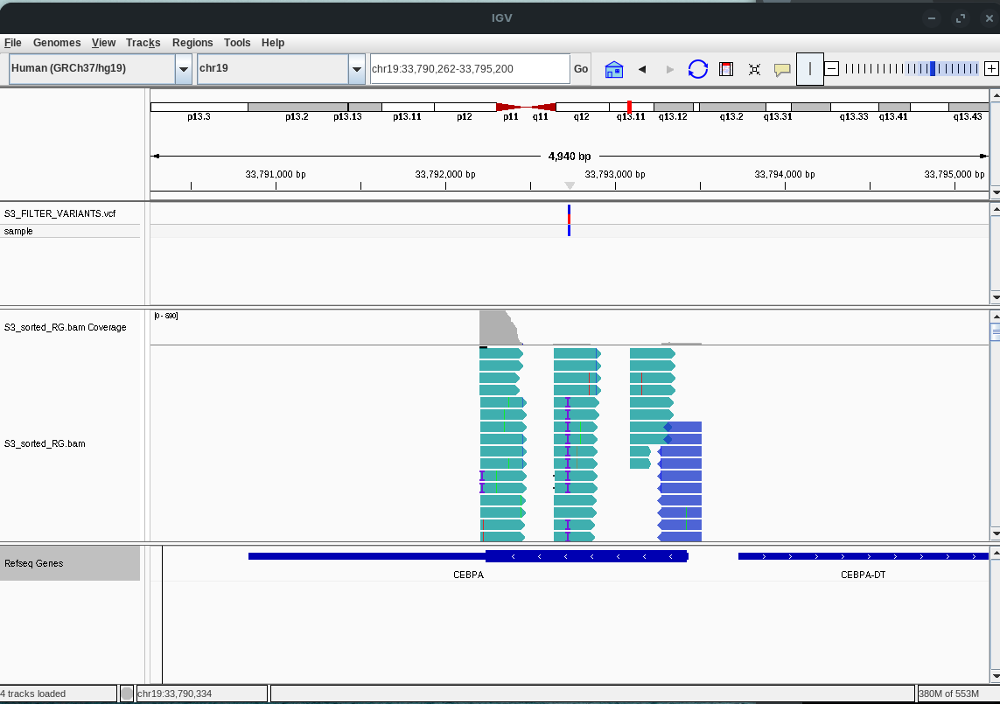

1. Realizar el alineamiento contra el genoma humano hg19 de las 
   lecturas R1 y R2 del paciente seleccionado para la tarea de control de 
   calidad de lecturas de secuencia.
   Esto ya fue realizado, se adjunta el codigo empleado en la carpeta Tarea_3.3 en formato txt

2. Utilizando una línea de comando, encuentre la primera lectura en el 
   archivo SAM que contenga bases enmascaradas (secuencias suavizadas por 
   soft-clipping)
   se uso el comando 
   
   ```
   awk '$0 !~ /^@/ && $6 ~ /S/ {print; exit}' ./S3.sam
   ```
   
   Se obtubo como resultado:
   
   ```
   M03564:2:000000000-D29D3:1:1101:15201:1724    113    chr2    198257295    60    2S100M    =    198257295    0    GGGGGGGGGGGGGAACCTACTAATTACACTGCTCTTAAGCTGCAATGGAAGAGACAAAACTCACTCCCCTGTCACCACACAATTGTTCTACCATATGGCACA    GGGFE>/GGHHHFHHHHHHHHHHHHGHHHHHHHHHHHGHHHHHHHHHHHHHHGHHHHHHHHHGGGGGGHHHHGHGHHHHHGGGGGGGGGGFFFFFFFCCCCC    NM:i:0    MD:Z:100    MC:Z:2S100M    AS:i:100    XS:i:20
   ```

3. Muestre el registros de la lecturas en el archivo SAM e identifique y explique el código CIGAR de esa lectura.
   Para visualiszar el archivo sam se utilizo la herramienta samtools con el siguiente codigo
   
   ```
   samtools view ./data/S3.sam | less -S
   ```
   
   Se obtuvo el siguiente resultao 
   
   
   se tomo la siguiente lectura para explicar el codigo CIGAR
   
   ```
   M03564:2:000000000-D29D3:1:1101:16456:1577      65      chr5    149498274       60      224M1I26M       =       1
   ´´´
   El codigo CIGAR en este caso es 224M1I26M, lo cual significa que los primeros 224 nucleotidos coinciden, luego hubo una insercion y depues los 26 siguientes coinciden perfectamente
   ```

4. Generar un reporte técnico de calidad del alineamiento con *qualimap*.
   El archivo generado fue [qualimap](./data/S3_sorted_RG/)

5. Seleccionar 4 figuras que a su juicio sean las más informativas sobre la calidad de los datos y del ensamble.
   las figuras mas importantes son
   
   
   
   

6. Incluir las figuras en la sección de Resultados de un reporte 
   técnico. Describir cada figura con una leyenda descriptiva. 
   Adicionalmente, en el texto de la sección, interpretar los resultados y 
   citar cada figura. Debe referirse a la calidad de los datos y del 
   alineamiento. Enfóquese especialmente en los posibles problemas con los 
   datos o alineamientos. Comente potenciales razones que expliquen lo 
   observado. Incluya una sección con las principales *Conclusiones* para la muestra.
   Todos los resultados obteneidos se encuentran ubicados en la carpeta "data"

7. Incluya el reporte completo generado con *qualimap* como anexo.
   [qualimap](./data/S3_sorted_RG/)

8. Comparta el informe en formato markdown a través de github para dar por completada esta tarea.

## Analsiis y conclusiones


Figura 1: muestra la cantidad d electuras que tuvieronuna determinada profundidad, en este caso se muestra con profundidad de 0-50x , muestra que hay aproximadamente 8500 locaciones genomicas que no obtubieron lectura (profundidad 0)

Figura 2: se muestra la distrubucion de la profundidad de cobertura a lo largo del genoma. Se observa que hay regiones del genoma que no presentan buena covertura y otras regiones hay una muy buena cobertura, este tipo de distribucion puede afectar el analsis de variante posterior

Figura 3: Se muestra la distribucion de la profundidad de secuenciacion, en otras palabras se muestra cuanta parte del genoma esta cubierta por diferentes profundidades. Se observa que hay locaciones genomicas que estan  con una buena profundidad pero hay un numero importante de locaciones que no tienen covertura

Figura 4: Muestra el porcentaje del genoma de referencia que tiene una determinada profundidad, se obseva por ejemplo, que el 90% tiene a lo menos 1 o 2 de profundidad

Figura 5: Muestra como el porcentaje GC esta distribuido en el genoma. Muestra si el %GC se distribuye de manera uniforme o si hay regiones con una composicion inusual

Figura 6: Muestra la cantidad de inserciones y deleciones de AAAA, GGGG, CCCC o TTTT. Aqui se observan elevadas cantidades de indels, esto puede reflejar errores de secuenciacion o algun problema en la etapa de alineaimiento

Figura 7: Se muestra la calidad de mapeo a lo largo del genoma. Se observan extensas regiones donde la calidad de mapeo es baja

Figura 8: Muestra la calidad de mapeo de las lecturas alineadas. Se observa que la calidad de mapeo es alta para gran parte de las lecturas alineadas

Figura 9: Muestra la cantidad de clipping que hay por cada posicion de lectura. En este caso se observa que hay un elevado clipping alrededor de la posicion 80 de las lecturas

Figura 10: Se muestra el porcentaje de A, T, G, C que hay en cada una de las posiciones de las lecturas. No se ve que hayan sesgos aparentes

Figura 11: Esta figura indica si las lecturas estan bien distribuidas o si hay acumulaciuones que sugieren problemas

Segun el analisis realizado en cada una de las figuras, los comandos aplicados funcionaron bien, pero los resultados de los alineamientos y la calidad de estos nos dicen que existen problemas al moemnto de la secuenciacion, lo cual se podria deber propiamente a un problema en la construccion de las librerias o puede ser que el error se encuentre al momento de alinear las lecturas, peor todos los datoas apuntan a un problema en la secuenciacion de este genoma, debido a que se observan regiones en las cuales no se observo una lectura (profundidad 0)
En conclusion, este alinemainto de lecturas nos revela que no deberiamos fiarnos de los resultados obtenidos para todo el genoma, si se podrian rescatar los datos de alguna region en particular o podria tratarse de alguna mutacion patogenica en el genoma

# LLamdo de variantes

1) Seguir este tutorial con los datos de la muestra previamente elegida. Todas las muestras son de pacientes, para los cuales se sospechaba de una mutación patogénica. Se realizó una secuenciación de un panel de genes con equipamiento MiSeq.
   Esto ya fue realizado, se adjunta el codigo empleado en la carpeta Tarea_3.3 en formato txt

2) En materiales y métodos del reporte, indique el número de genes incluidos en el panel e incluya una tabla con la lista de genes (consejo: revise el archivo regiones_blanco.bed). Indique también la región genómica total (en pares de bases) cubierta por el panel, o sea, el tamaño de las regiones blanco (consejo: revise su reporte qualimapReport.html).
   No encontre le archivo regiones_blanco.bed

3) Realice el filtrado de variantes con dos filtros, DP<10 y uno adicional que usted proponga.
   Se propone que el filtro sea de DP<30

4) Estime cuántas variantes son eliminadas por el filtro DP<10 solamente, y cuántas por ambos filtros.
   Se compararon ambos archivos VCF utilizando los comandos:
   
   ```
   bgzip -c S3_FILTERED_SNP.vcf >  S3_FILTERED_SNP.vcf.gz
   bgzip -c S3_FILTERED_SNP_30.vcf >  S3_FILTERED_SNP_30.vcf.gz
   tabix -p vcf S3_FILTERED_SNP.vcf.gz
   tabix -p vcf S3_FILTERED_SNP_30.vcf.gz
   bcftools isec -p comparacion_FILTROS S3_FILTERED_SNP.vcf.gz S3_FILTERED_SNP_30.vcf.gz
   ```
   
   usando `bcftools view -H 0002.vcf | wc -l` y visualizando la cantidad de filtrados, con el DP<30no se filtraron menos datos, se mantienen las 5 variantes encontradas
    En total se lograron encontrar 5 variantes 
   Para los indels, se uso:
   
   ```
   bgzip -c S3_FILTERED_INDEL.vcf >  S3_FILTERED_INDEL.vcf.gz 
   bgzip -c S3_FILTERED_INDEL_30.vcf  >  S3_FILTERED_INDEL_30.vcf.gz
   tabix -p vcf S3_FILTERED_INDEL.vcf.gz
   tabix -p vcf S3_FILTERED_INDEL_30.vcf.gz
   bcftools isec -p comparacion_FILTROS_INDEL S3_FILTERED_INDEL.vcf.gz S3_FILTERED_INDEL_30.vcf.gz
   ```
   
   Se compararon usando `bcftools view -H 0002.vcf | wc -l` 
   Aqui solo se encontro una variante y no se logro encontrar una difrencia con el filtro de DP<30 aplicado

5) Genere un reporte e incluya una tabla con el número de variantes detectadas totales, SNPs, e INDELs. Para cada caso, indicar el número de variantes filtradas y que pasaron los filtros (solo uno, y ambos)
   se uso  ` bcftools view S3_FILTERED_SNP.vcf ` para ver los archivos VCFs
   
   aqui se encontraron 5 variantes
   con `bcftools view S3_FILTERED_INDEL.vcf` 
   
   Aqui solo se encontro 1 variante de este tipo
   Tabla de variantes encontradas:
   

6) Visualice una variante en IGV, mostrando tracks tanto para el alineamiento (bam) como las variantes detectadas (VCF).
   las siguientes imagenes muestran la pociciones de la 6 variantes detectadas
   
   
   
   
   
   
   

7) Asegúrese de usar un tamaño de ventana que muestre suficiente detalle como para leer la secuencia de referencia, pero sin un zoom excesivo para que se logre ver algo de contexto de secuencia. Ojalá que se vean otras variantes al rededor de la central. Incluya un track con los genes. Si no se ve ningún gen cercano a la variante, elija otra variante.
   
   
   Se puede observar que en esta region se encuentran varias variantes cercanas al mismo gen, especificamente se encuentran cuatro variantes

8) 
