<title></title>

# Tarea 3.4

A
continuación, se mostrara el tutorial de Qiagen

### 

Paso 1

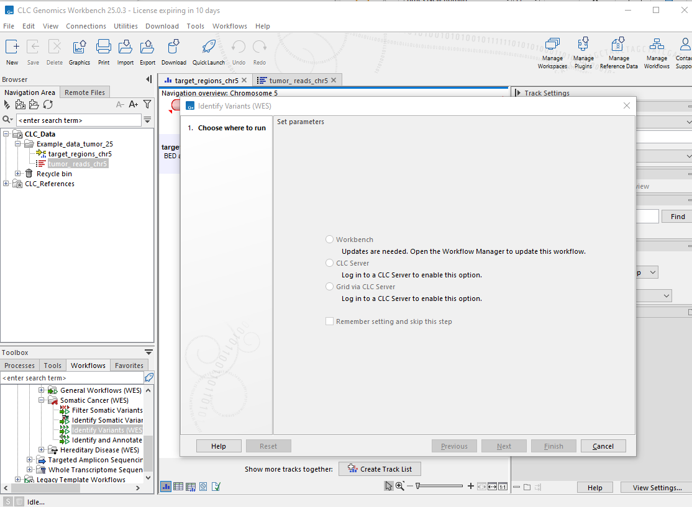

### 

Paso 2: selección de las lecturas

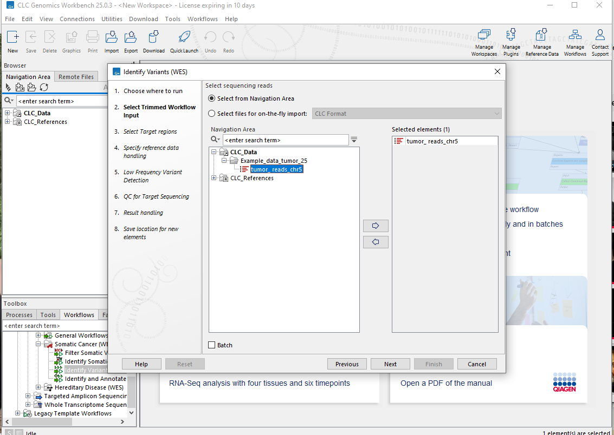

### 

Paso 3: selección del target

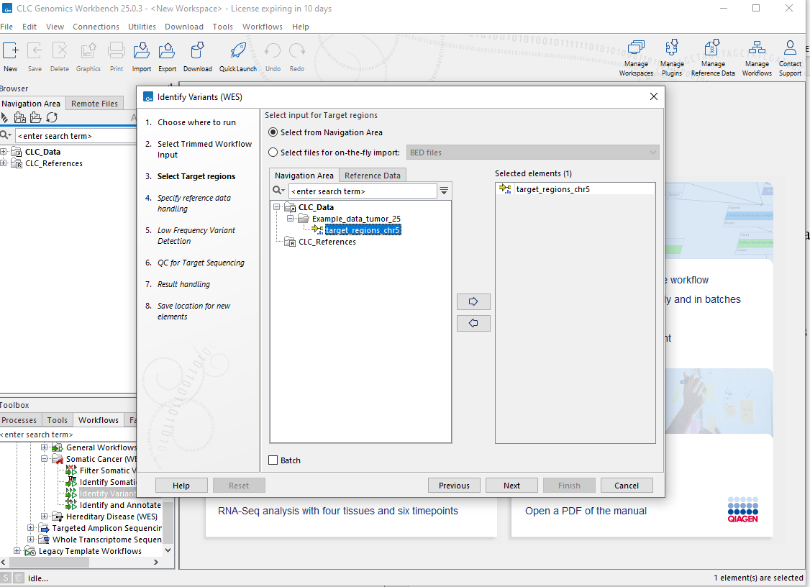

### 

Paso 4: specity reference data handing

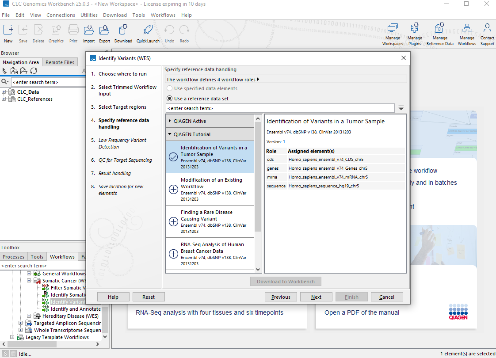

### 

Paso 5: low frequency variant detection

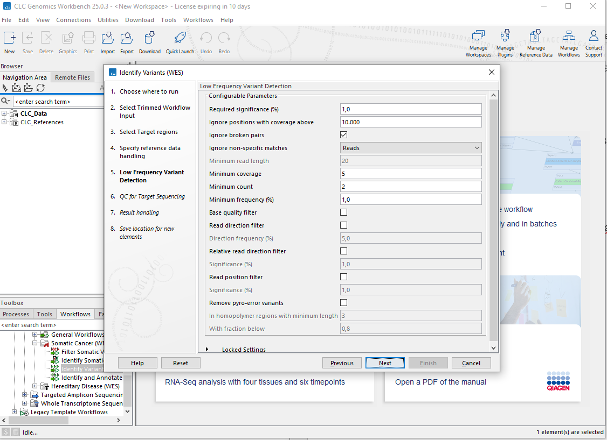

### 

Paso 6: QC for target sequencing

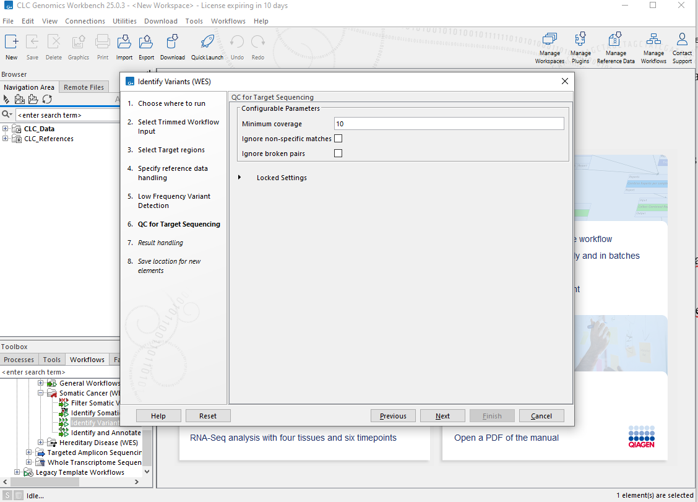

### 

Paso 7: visualización de los resultados

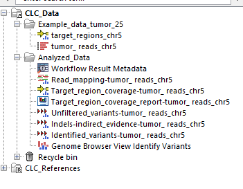

A
continuación se muestra la visualización del reporte

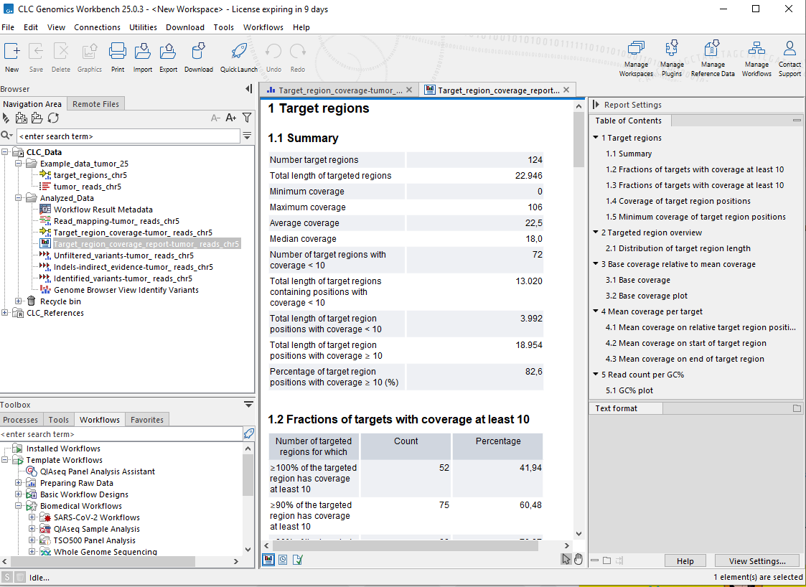

Se
ve una cobertura media de las regiones objetivo de 18, esto supera el
mínimo establecido de 10

Ahora
se muestra la descripción general del target

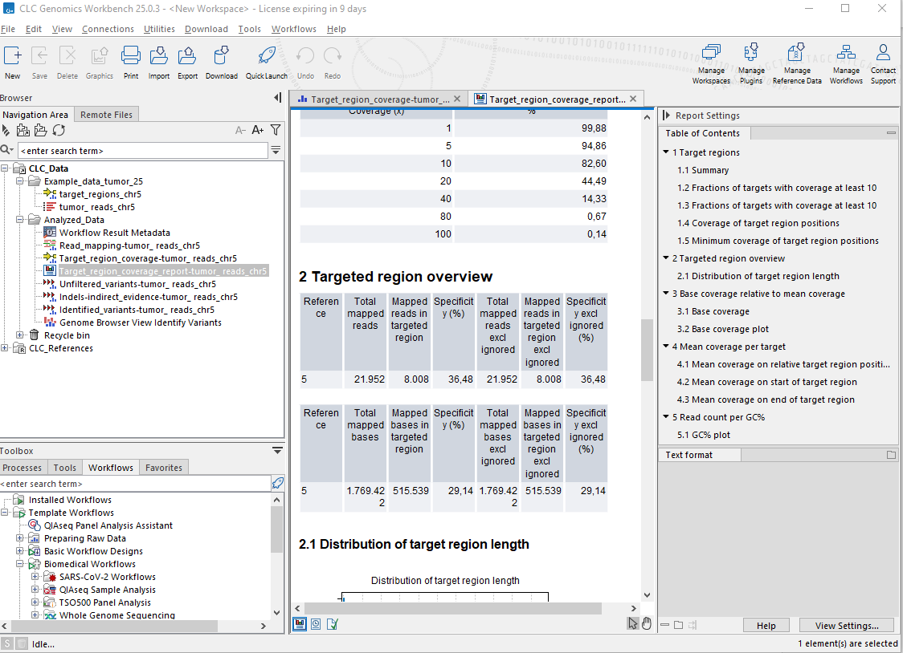

Se
ve que los valores obtenidos son bajos para el protocolo que se
empleó, pero esto se debe a que solo se están considerando las
lecturas de una sola región

El
71 % de todos los objetivos están cubiertos en más de un 80 % con
al menos 10 lecturas.:

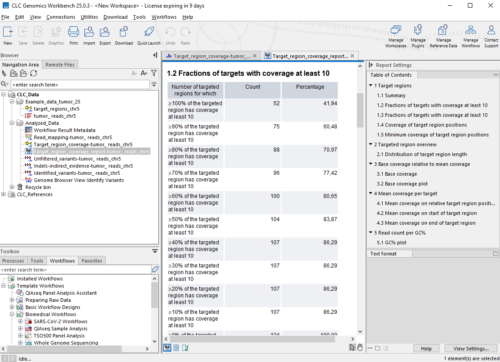

Se
observa que 13 variantes que son diferentes de la secuencia de
referencia humana.

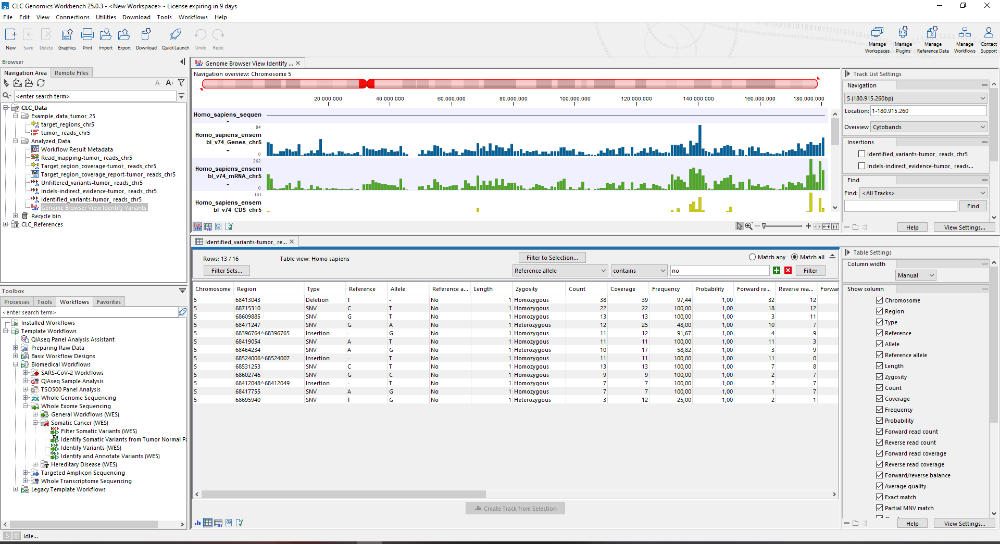

Al
parecer ninguna de las variantes observadas se debe a errores en el
PCR

Se
utilizo la herramienta dbSNP para buscar de acuerdo a la posición de
las variantes encontradas

Con
respecto a la posición 68413043, solo hay una variante de deleción
reportada en el NCBI db SNP, como se ve en:

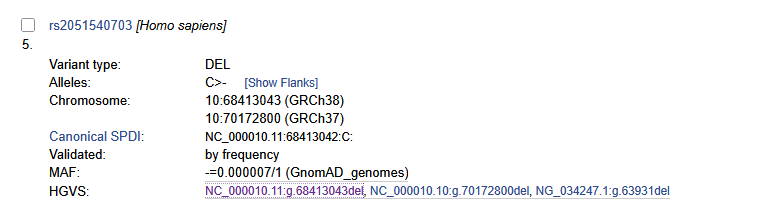

En
la posición 68417755 se encontraron 2 variantes reportadas con el
remplazo de A por G

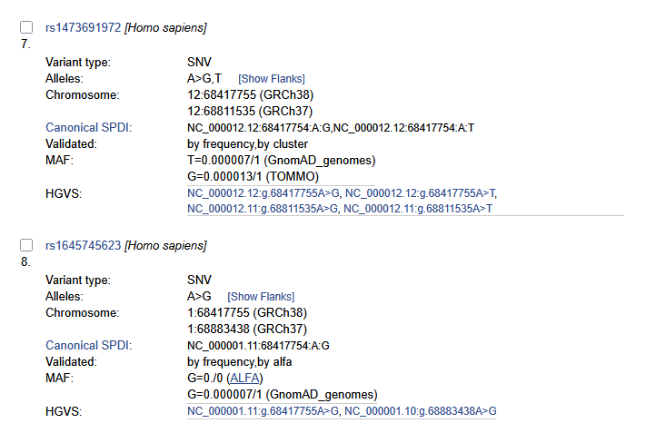

En
la posición 68471247 hay reportada 2 de este tipo de variantes

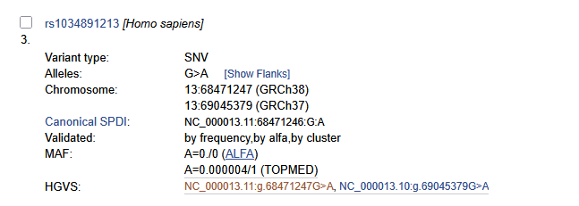

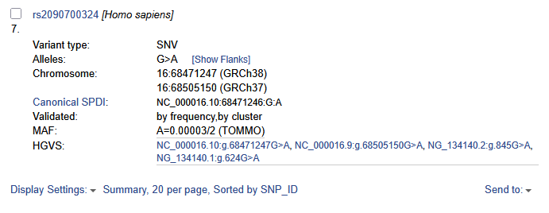

En
la posición 68531253 se encontraron 3 variantes reportadas

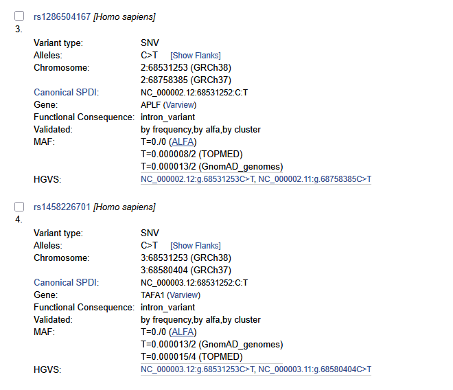

En
la posición 68602746 se encontró 1 variante reportada

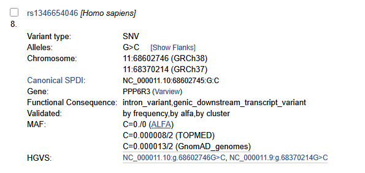

En
la posición 68609885 se encontró 1 variante reportada

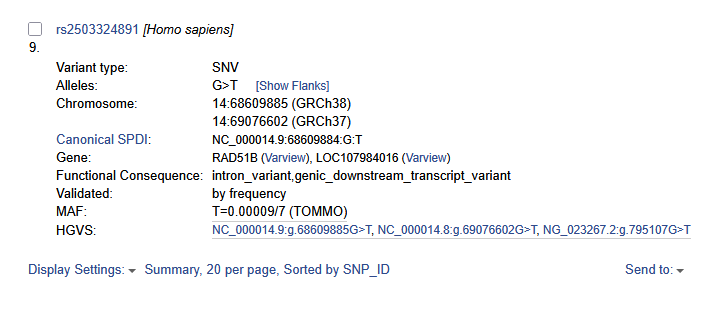

En la posición 68419054, 68464234, 68695940 y 68715310 no están
reportadas estas variantes

Finalmente
se puede concluir que es muy probable que las variantes que se
encuentra reportadas puedan servir para poder definir un pronóstico
del cáncer o podría tambien definir la gravedad o agresividad del
mismo, para las variantes que no han sido reportadas, habría que
entrar mas en detalle para analizar si podrían estar relacionadas
con algún efecto en las células tumorales que nos pudiera servir
para predecir la gravedad del cáncer
