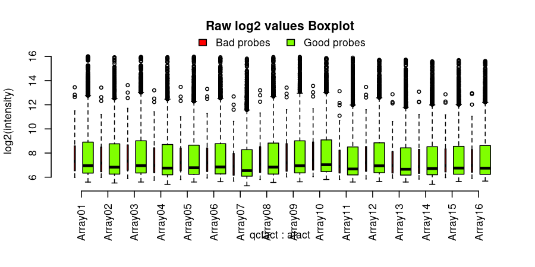
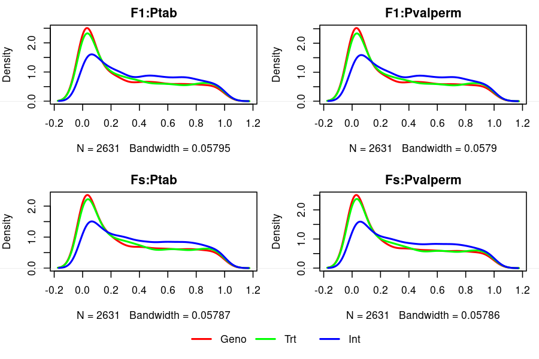
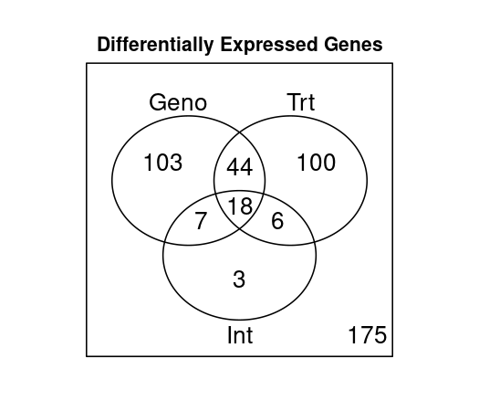
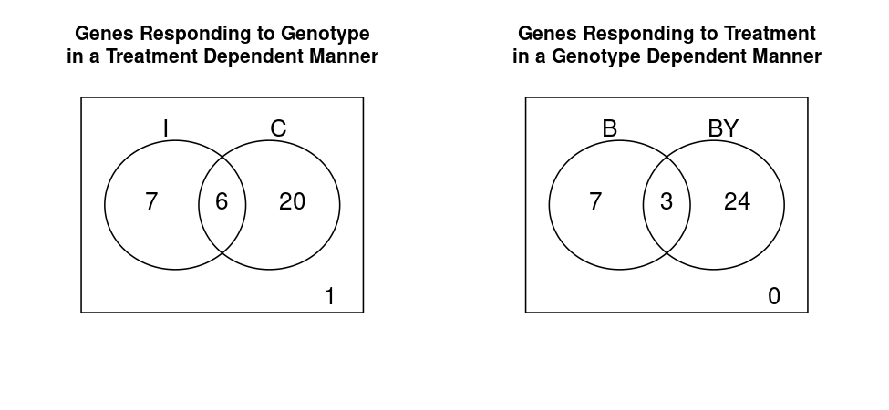

# Tarea 4.1

Alejandro Ahumada Quintanilla

En primera instancia  para aleatorizar los datos se utilizo el comando:

```
shuf -n 5000 Illum_data.txt > Illum_data_AAQ.txt
```

Posteriormente se realizaron las modificaciones solicitadas en la tarea

Luego se ejecuto el script correspondiente de R con las modificaciones necesarias y se obtubieron los siguientes resultados:

el codigo de R utilizado para este tutorial con sus cambios respectivos se encuenta ubicado en la carpeta DE-Tutorial

Incluyendo los dos archivos .cvs llamados DE_results y GO_BP_Table

Aqui se observan los valores antes de la normalizacion, se observa que de todas formas hay mas sondas buenas que malas

Ahora se separan los datos por tratamiento, Castrados versus intactos, no se observan grandes diferencias entre los trataminetos y tampoco se ve efecto en la posicion

En esta figura se observa que la calidad de los datos es bastante buena

Se muestran las distribuciones de los valores de p, donde podemos ver que en ambos casos son muy similares entre si

Se observa el diagrama de Venn para los individuos por genotipo, tratamiento e intactos, se observa que entre estas tres caracteristicas se comparten 18 genes expresados diferencialmente 


Ambos diagramas anteriores muestran lo mismo pero la distrubucion es diferente, a la izquierta se muestra por intactos o castardos y a la derecha se muestrasn segun su genotipo. En este caso, en el lado izquiero observamos que hay 20  genes que se expresan de forma diferencial en la condicion de castrados, lo cual estari indicado que el echo de estar castarados, es decir que les falte testosterona afecta a la expresion de estos genes. Por otro lado, al lado derecho se observa que el genotipo tambien influye en la expresion de estos genesAre you happy with your studies
