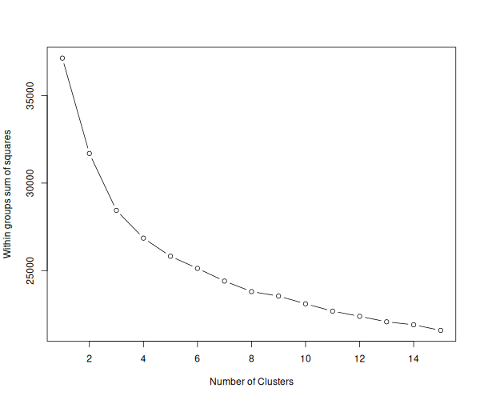
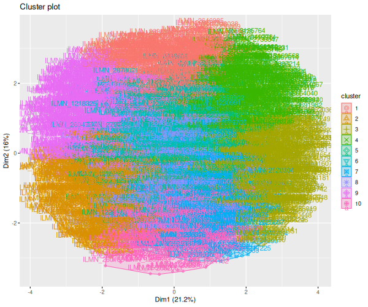
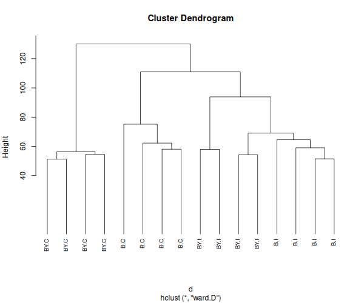
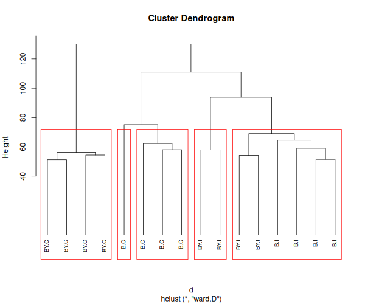
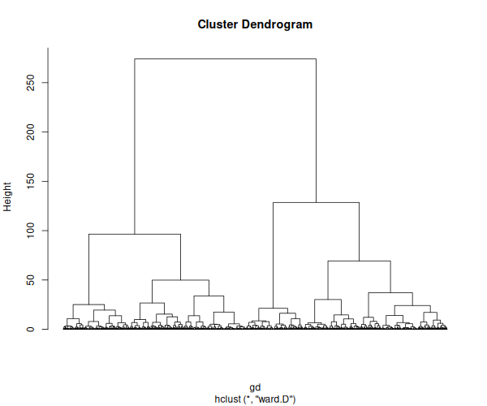
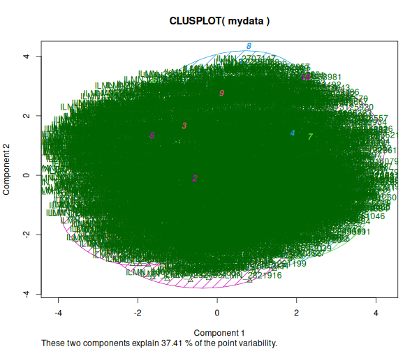
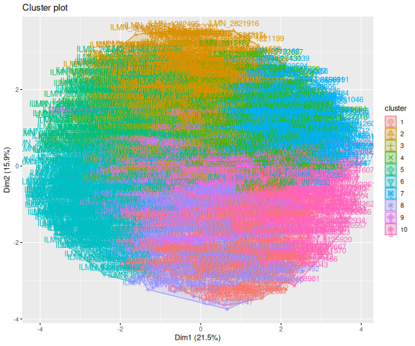
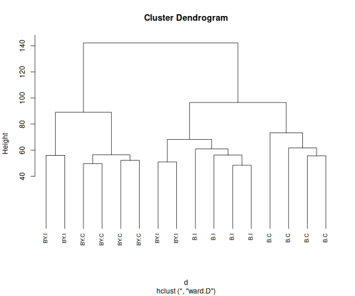
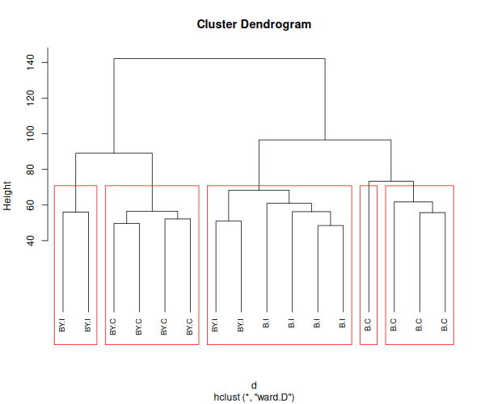
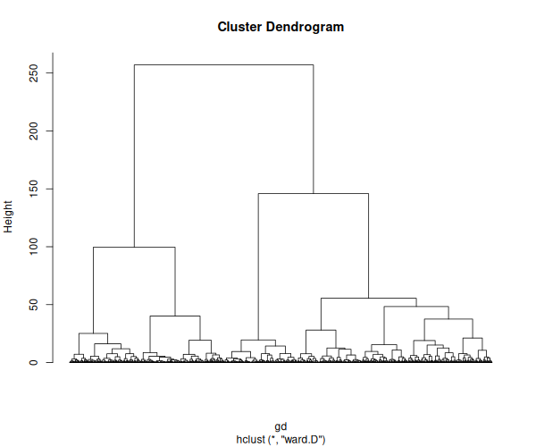

# Tarea 4.2

Alejandro Ahumada Quintanilla

```
outdir     <- "output"

if(!file.exists(outdir)) {
  dir.create(outdir, mode = "0755", recursive=T)
 }

Data.Raw  <- read.delim("Illum_data_AAQ.txt")
signal    <- grep("AVG_Signal", colnames(Data.Raw)) # vector de columnas con datos 
detection <- grep("Detection.Pval", colnames(Data.Raw))

annot     <- read.delim("MouseRef-8_annot.txt")
probe_qc  <- ifelse(annot$ProbeQuality %in% c("Bad", "No match"), "Bad probes",
  "Good probes")

design    <- read.csv("YChrom_design.csv")
print(design)

Data.Raw <- Data.Raw[probe_qc %in% "Good probes",]
annot    <- annot[probe_qc %in% "Good probes",]

rawdata           <- as.matrix(Data.Raw[,signal])
rownames(rawdata) <- Data.Raw$PROBE_ID
colnames(rawdata) <- design$Sample_Name

library(preprocessCore)
normdata           <- normalize.quantiles(rawdata) 
colnames(normdata) <- colnames(rawdata)
rownames(normdata) <- rownames(rawdata)

probe_present      <- Data.Raw[,detection] < 0.04
detected_per_group <- t(apply(probe_present, 1, tapply, design$Group, sum))

present  <- apply(detected_per_group >= 2, 1, any)
normdata <- normdata[present,]
annot    <- annot[present, ]

write.table(normdata, file.path(outdir, "normdata.txt"), sep="\t", row.names=T)
```

Para realizar el tutorial se realizo el ajuste mencionado durante la clase

```
 mydata <- t(scale(t(mydata))) 
```

Segun el grafico entregado de k-means, se definira un valor de K de 10


Los resultados obtenidos de los analisis se muestran a continuacion, Para esta actividad de utilizaron los datos obtenidos del tutorial anterior






Para los datos de mis muestras los resultados fueron;







La diferencia mas notoria entre estos dos graficos se ve en el cluster dendrogram
